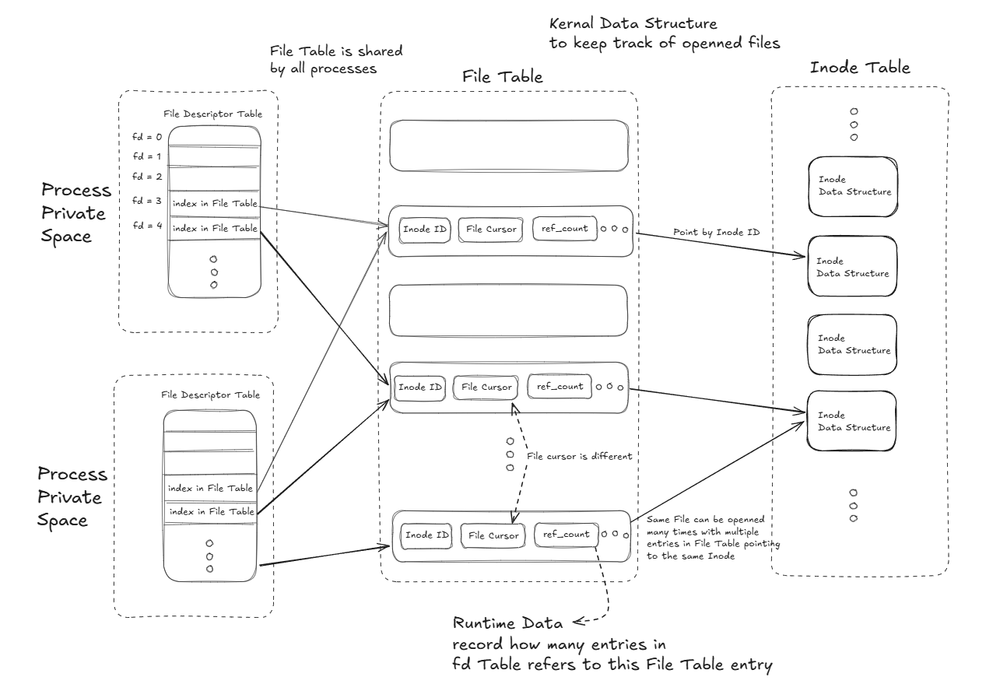
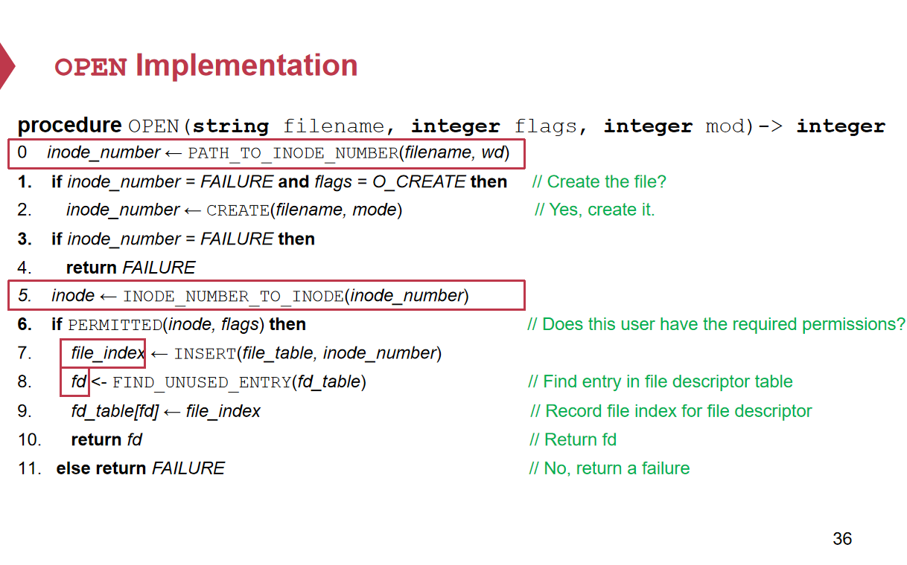
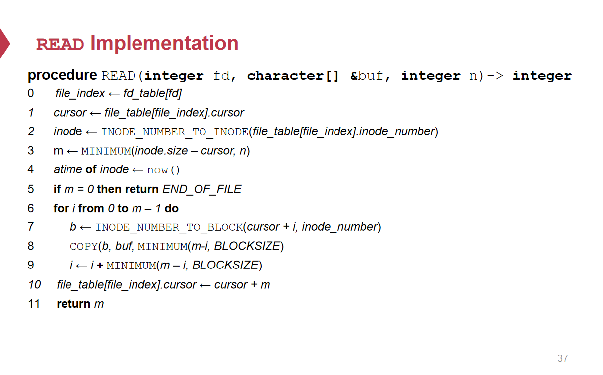
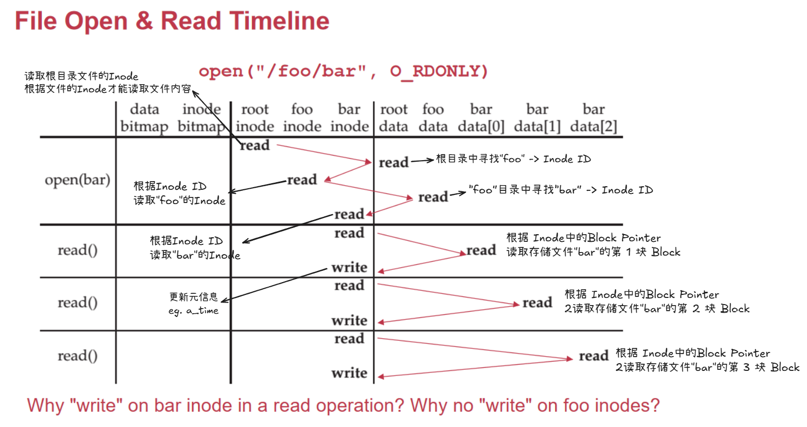
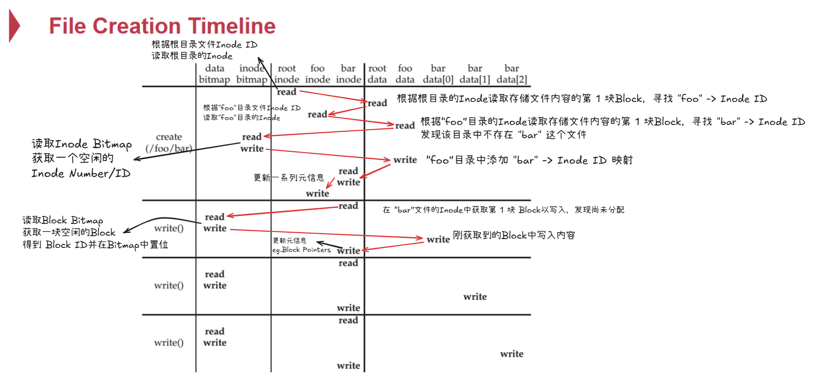
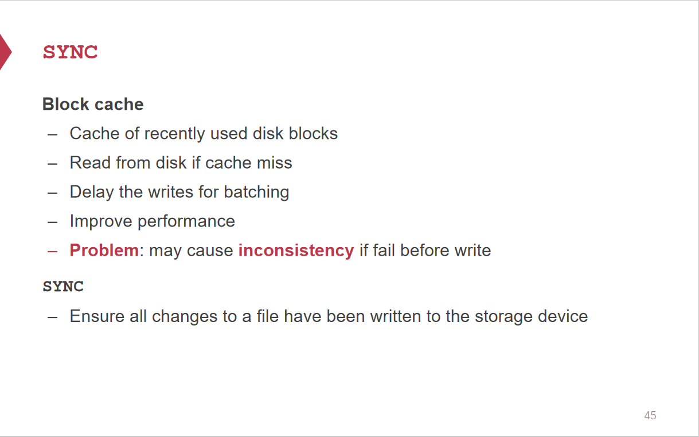
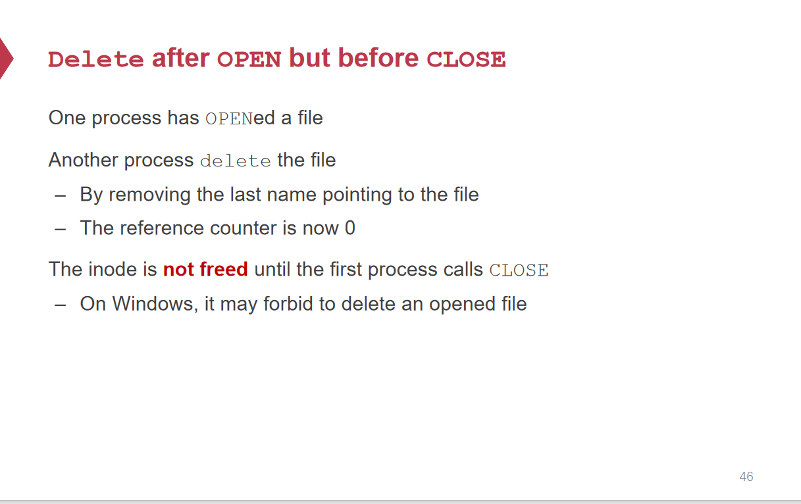

# File System API

## API层结构

## Open

> 

## Read

> 

## File Open & Read

## File Creation & Write

文件写入操作顺序：

* Update Block Bitmap | Write New Data | Update Inode(size & pointer)
  * 更新完Bitmap后出现故障，新的数据没写入，带来的问题是浪费一块Block空间(Bitmap已被置位而实际没有写入)
  * 写入新数据后出现故障，没有更新Inode中的Pointer，相当于没有分配，带来的问题是浪费Block空间
* Update Block Bitmap | Update Inode (size & pointer) | Write New Data
  * 更新完Bitmap后出现故障，新的数据没写入，带来的问题是浪费一块Block空间
  * 更新Inode中Pointer和Size后故障，却没有写入新的数据，可能导致数据泄漏，即刚分配的Block中旧数据没有被覆盖掉，进行读的时候可以读取到旧的数据造成泄漏。
* Update Inode (size & pointer) | Update Block Bitmap | Write New Data
  * 更新完Inode出现故障，相当于已经分配给Inode一个新的Block，但是对应的Block在Bitmap中没有置位，可能被重复分配给另一个Inode，造成两个Inode共享一块数据Block，数据会动态泄露
  * 更新完Block Bitmap后出现故障，带来的问题只是数据没有写入。

一般情况下，第一种方式更能够接受，剩下两种都会造成数据泄漏。

## Sync

## Delete

