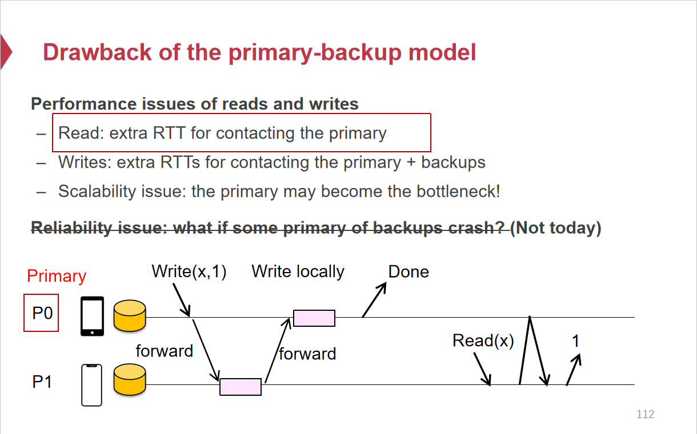

# 分布式一致性

## 分布式系统中的一致性

分布式系统数据存储一般会有**多个副本**，数据需要在不同节点之间**同步**，即在一个节点进行写入之后，需要将数据复制到其他节点中。这就会存在**一致性问题**，即对于一个数据，在分布式系统中**不同节点**进行读取得到**不同的结果**（复制会存在**网络延迟**）。**分布式系统中的一致性**指的是**分布式系统中不同节点中的数据副本保持一致**。

CAP定理中的一致性指的是对于**分布式系统中某个对象的值读取总能得到最新的值**。CAP定理中的一致性与这里的一致性有差异。

## 时钟

* 墙上时钟（Wall Clock）：墙上时钟是根据日历得到的当前的日期与时间，墙上时钟是需要进行同步的
* 单调时钟：单调时钟的值可以没有实际意义，而单调时钟值得到的差可以用来衡量经过的时间

分布式系统中进行时间同步无法做到完全的同步，因为“墙上时钟”的同步依赖于很多外部因素，而且分布式系统中节点与节点之间的通信是存在网络延迟的，所以分布式系统中的时钟是可能存在不同步的现象的。

## 一致性模型 Consistency Model

一致性模型可以认为是一种协议，在分布式系统中，并发数据存储（读/写操作）遵循某种规则，就可以保证操作结果是可预测的。在分布式系统中进行一系列并发的数据读写操作，这一系列操作形成一个历史操作记录，而一致性模型就是用来定义在这个系统中哪些历史记录是合法的，按照一致性模型的约束，就可以实现分布式系统数据副本的一致性。

### 强一致性 & 弱一致性

* **强一致性**：当系统中的某个数据被成功更新后，之后对该数据的所有读操作都能获取到最新更新的这个值。（更新过的数据后续访问都能读取到最新值）
* 弱一致性：不要求每次读都必须读取到最新的值。

### 严格一致性 Strict Consistency

* **严格一致性**下的所有并发数据操作**等价于某种线性执行**

* **严格一致性**要求对于分布式系统中所有的数据操作必须按照**全局“墙上时钟”**的顺序进行（即使执行时间有交织的并发操作也必须要按照实际的“发射时间”（issue time）进行发生），相当于整个系统的所有操作必须退化为单一线程的顺序执行。

  

严格一致性难以实现。

* 严格一致性要求整个系统的所有数据读写操作要按照现实的时间发生，分布式系统中完全统一时间是困难的
* 由于存在网络延迟，读写数据的请求从客户端发出的顺序与实际到达服务器的顺序不一致是正常的，在存在网络延迟的情况下实现严格一致性并不实际。

严格一致性的性能表现很差。

* 分布式系统如果按照严格一致性来执行并发数据存储操作，实际上退化成单线程一个操作一个操作执行，不存在并发。

### 顺序一致性 Sequential Consistency

* 顺序一致性下的所有并发数据操作总是**等价于某种线性执行**

* 顺序一致性要求对于分布式系统中的数据操作必须按照各自**进程**中的**开始-结束顺序**。即其等价的线性执行中，来自于同一进程的操作顺序必须于原进程中的顺序一致。

将满足顺序一致性的数据操作序列转化为全局中某个等价的线性执行序列，不同进程执行的操作并不会按照现实中的时间顺序，但是来自**同一个进程的操作**在**等价线性执行序列**中的顺序必定与在**原本进程中操作的顺序**一致。

顺序一致性不是强一致模型。顺序一致性保证了当一个进程读取到一个新的状态以后，这个线程中之后的读取操作不会读取到这个新状态之前的状态，并且保证对于数据的读取**顺序**一定是全局一致的，但并不保证不同进程对数据的读取顺序按照全局时钟，因此从用户角度来看会发生“回跳”，不能保证每次都读取到最新的值。

### 线性一致性 Linearizability

* 线性一致性下的所有并发数据操作总是**等价于某种线性执行**。
* 线性一致性要求对于分布式系统中的数据操作序列要满足**全局**上的“**结束-开始**”顺序，也就是说当某个节点中开始执行数据读操作，必定可以看到分布式系统全局中所有节点已经**结束**的写操作。但是对于读写交织的并发操作，仍然有可能读取到旧的值，线性一致性并严格要求并发读写交织的情况。

线性一致性模型是强一致性模型。线性一致性模型约束下的分布式系统数据操作序列等价为线性执行序列，这个线性执行序列中每个读操作必定可以看到之前已经完成的写的状态，也就是说每次读取数据都可以得到最新的数据。

### 最终一致性 Eventual Consistency

最终一致性并**不保证**在分布式系统中每次进行读都可以读取到最新的值(recall:分布式系统中不同节点数据副本需要同步，在**不同节点进行本地读并不能保证每个时刻值都是一致的**)，但最终一致性保证在分布式系统中**不进行新的写操作**时，经过**一定时间**，这个分布式系统**最终**会达到所有**数据副本一致**（但并没有保证一定时间是多久）。

## 线性一致性实现-主备模式 Primary-backup Model

### 写操作（同步复制）

* 写操作**必须都经由主机**，客户端发起一个写操作至主机，主机将数据更新通过网络转发到各个备用机中，等待备用机在各自本地进行写操作成功后，主机进行本地数据更新，返回操作成功给客户端。（主机必须**同步地等待**所有备用机完成数据复制，也就是说必须所有节点中副本的都完成写才能算写操作执行成功）
* 主机必须决定写的顺序，保证发送到备用机之后写的顺序是一致的。（网络问题）

### 读操作

* 本地读：允许将在备机上进行读操作，备用机直接读取备用机本地的数据并且返回给客户端（**本地读无法满足线性一致性的要求**）
* 主机读：发送至备机上的读操作，必须将**读操作转发至主机**中进行读取，主机将读操作转发回备用机，然后备用机返回给客户端

主备模式**同步写** & **主机读**保证了**线性一致性**。

> 

## 参考材料

* CSE-09 Eventual Consistency.pptx
* CSE-08 Consistency-v4.pptx
* 《深入理解分布式系统》,唐伟志
* 《Designing Data-Intensive Applications 数据密集型应用系统设计》, Martin Kleppmann