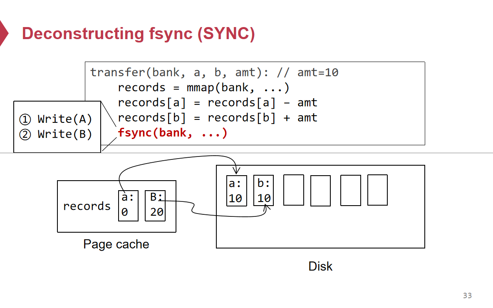
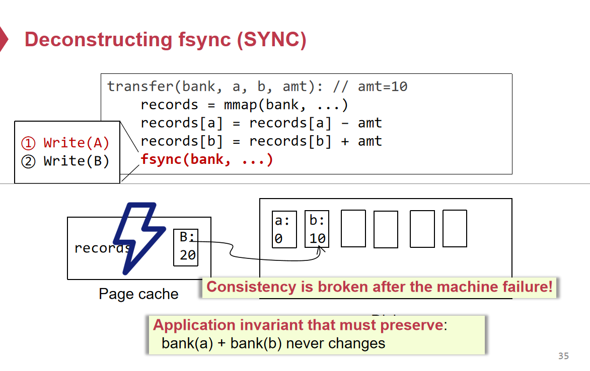
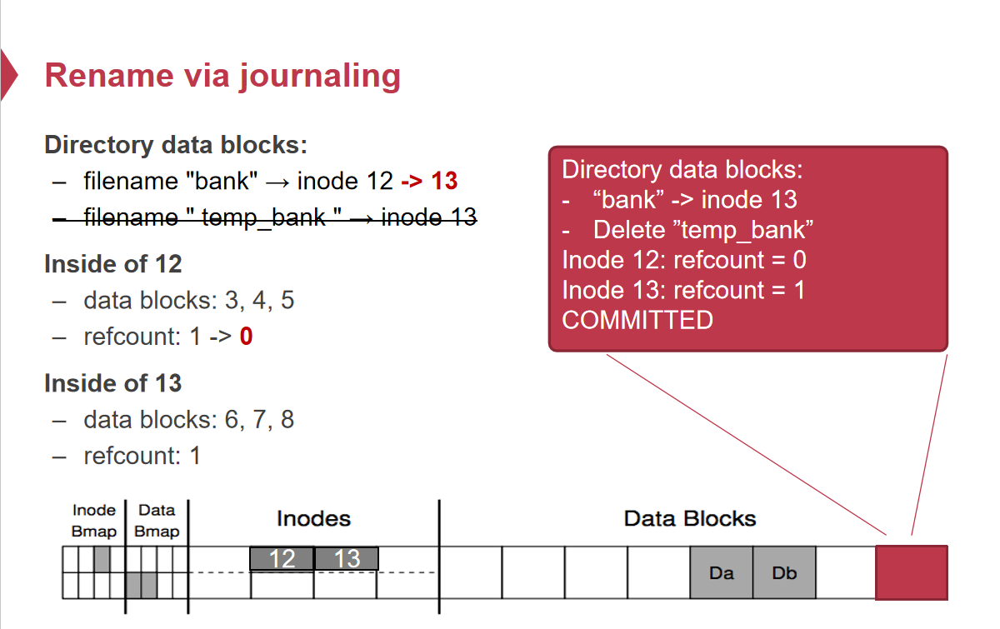
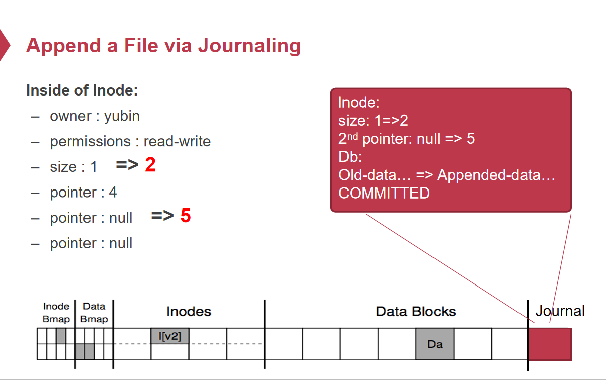
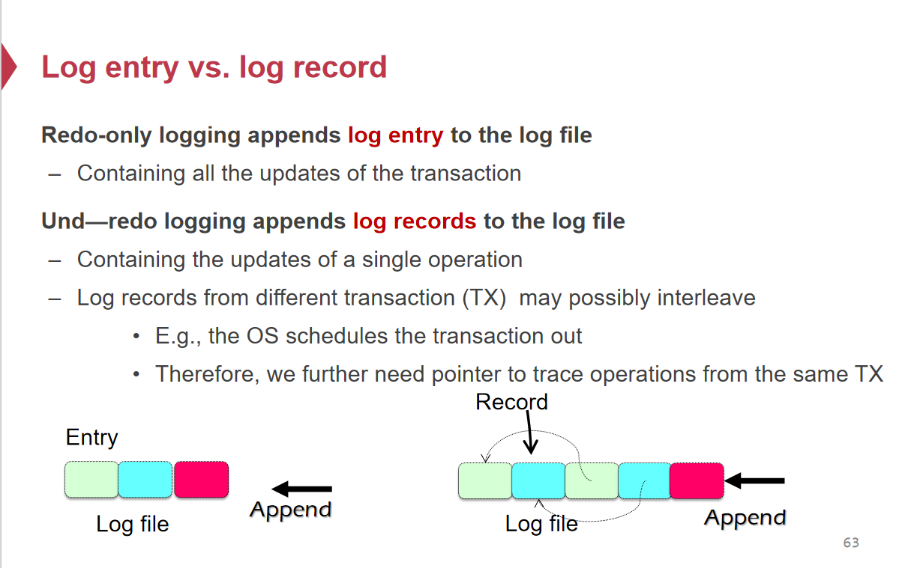
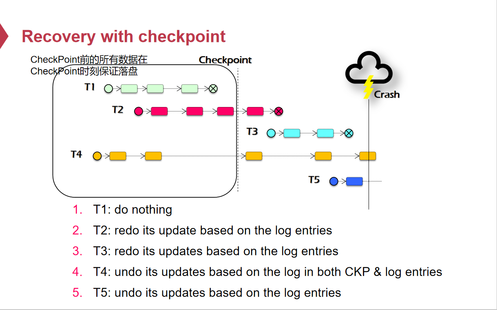
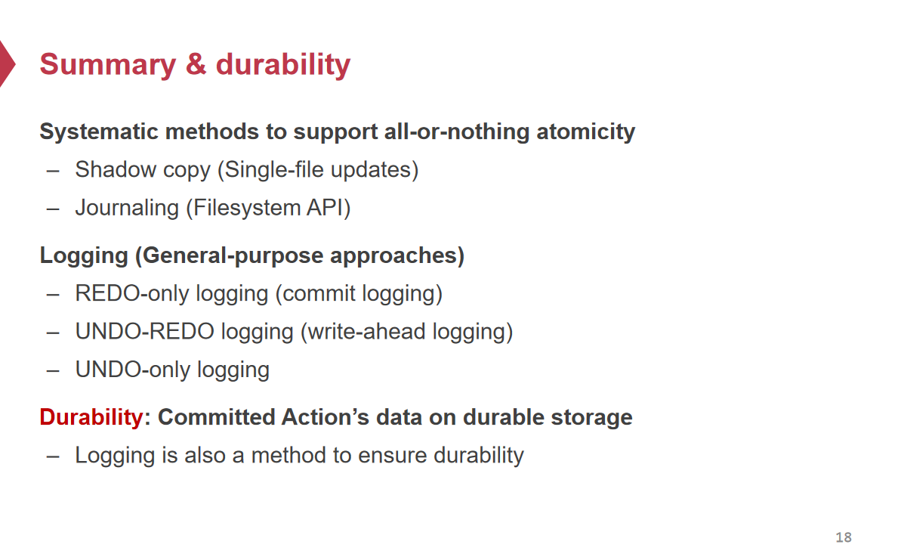

# 原子性

## All-or-Nothing Atomicity 原子性

原子性指的是对于一系列操作，要求它们的执行构成一个原子的单元，要么全部成功执行，要么全部没有执行。

如果一个操作集合不能保证原子性，那么就有可能出现所有操作失败、部分操作成功、全部操作成功的三种情况，在系统进行数据操作失败的情况下难以定位错误。

> 在操作系统中，文件写入就有可能出现数据写入部分失败的问题。
>
> 假设在单机场景下执行这样一个函数
>
> ```
> transfer(bank,a,b,amt):
>     records = mmap(bank, ...);
>     records[a] = records[a] – amt;
>     records[b] = records[b] + amt;
>     fsync(bank, ...) ;
> ```
>
> mmap在page cache中创建一个到磁盘文件的映射，能够像访问内存一样直接对这个文件进行读写。
>
> 一般对文件的写是不会直接落盘的，而是先写入到page cache中，稍后再批量写回磁盘，fsync强制将page cache中的所有修改刷写到磁盘，确保数据真正持久化。
>
> 将数据写入磁盘的粒度一般是Block，但是Block实际是由多个磁盘中的Sector构成的，也就是说物理上能够保证写入原子性的写入单位是Sector，从上层看来逻辑上一起写入到磁盘的数据，如果存储在不同的Sector，物理上就不是一起写入的。Sector是物理上保证写入原子性的写入单位。
>
> 对于以上例子，如果a，b的数据写入的是不同Sector/Block，当a的数据所在的Sector/Block写入完毕，而机器出现问题导致fsync失败，那么b的数据所在的Sector/Block未写入，此时磁盘中就会出现a的数据被刷新而b的数据没有刷新，出现正确性问题。



------



## Shadow Copy 影子读写

### 核心思想

Shadow Copy基于**Copy-on-Write**的思想，在对文件进行修改的时候，并不直接在原文件上进行修改，而是创建一个**原文件的副本**，在这个**副本上进行修改**，当所有更新操作执行成功时，用副本替代掉原文件。

关键点在于

* 并不直接修改原文件（在进行数据修改的时候存在一个原始副本，当修改出现失败时不会影响原文件的一致性）
* 所有写操作成功后将Shadow Copy文件替换原文件（保证所有写操作呈现出原子性）

> ```C++
> transfer(bank, a, b, amt):
>     fcopy(bank, bank_temp)	//创建一个Shadow Copy副本
>         
>     records = mmap(bank_temp, ...)	//在 Shadow Copy副本上修改
>     records[a] = records[a] – amt
>     records[b] = records[b] + amt 
>     
>     fsync(bank_temp, ...)    //Shadow Copy副本完成持久化
>     rename(bank_temp,bank)	//用Shadow Copy副本替换原始文件
> ```
>
> 按照Shadow Copy的思路对写操作进行修改。
>
> * `fcopy`与`fsync`操作对于原始文件都不会做出任何修改，在这两个操作中原文件都是只读，如果系统出现任何问题导致操作没有完成，并不会导致原文件出现任何一致性问题
>
> * `rename`需要修改多个Block的内容
>
>   * 修改`inode`中的meta data (eg.`ref_count`)
>   * 修改`directory`中的名称到`inode`映射
>
>   这就意味着中间如果出现问题，会引起文件系统本身的错误。比如，两个文件名指向同一个`inode`内容，而`inode`中记录的`ref_count`为1
>
> * 利用文件系统中的Journaling机制保证rename这个操作在文件系统层面的原子性

### 局限性

* Shadow Copy对于并发修改同一文件不友好。

  > 假设两个Client对于同一文件bank进行修改，Client_1需要修改其中的数据项a、b，Client_2需要修改其中的数据项c、d。
  >
  > Client_1先创建一个副本bank_temp，对其中的a进行了修改，但b尚未修改。
  >
  > Client_2此时要对bank进行修改，若
  >
  > * 直接根据bank文件再创建一个副本，那么最终两个基于bank创建的副本替换原文件时，要么Client_2的副本被Client_1创建的副本覆盖，要么Client_2的副本覆盖掉Client_1创建的副本。
  > * 若直接复用Client_1创建的bank_temp副本，对c、d完成了修改，并将数据持久化到磁盘，并且之后发生了崩溃，而Client_1因为线程调度等原因没有修改b，此时磁盘中的文件出现了不一致：只有a、c、d发生了修改。

* 对于多文件存储保证原子性修改不友好，如果有多个文件想要保证数据写入正确，对于每一个文件都要单独做一次Shadow Copy，开销很大。

* 即使是对于少量修改也需要复制整个文件。

## Journaling

Journaling的核心思想在于`Record Before Update`，对于一组数据修改操作，想要保证原子性，按照如下原则：

* 在Journal中记录更改
* 提交Journal
* 进行数据更改

如果系统出现崩溃：

* 在Journal提交之前发生崩溃：此时并没有进行数据更改，但是日志中已经记录了想要进行的操作，并且日志中的内容并不完整，需要将这一部分日志丢弃。
* 在Journal提交之后发生崩溃：此时日志中已经完整记录了想要进行的一组操作并且日志是已经持久化了的，按照Journal中记录，操作重新执行这一组操作。

这样子就能保证一组操作的原子性，要么都没有执行，要么全部执行成功。Journaling本质上是Log的简化版，在文件系统层面采用Journaling来保证对于跨多个Block的数据修改操作的原子性。Journaling需要在文件系统中预留下一个Sector来作为Journal的存放位置。如果Journal中要记录的操作内容过长，而磁盘物理上能保证原子性写入的单位是Sector，这样就会引发许多额外的问题，需要引入更复杂的技巧来解决。





## 日志

### 原子操作

* 事务：一组具有原子性的操作集合，这些操作要么全部执行成功，要么全部未执行。
* 接口：事务一般提供`begin` & `commit`两个接口来标志事务的起止，`begin`& `commit`之间的所有操作会在日志中有对应的日志条目。
* 提交点（Commit Point）：当事务进行到某处之后，能够保证事务的操作集合是可以恢复的，这个位置就是Commit Point。一旦经过Commit Point，就认为这个事务处于All-or-nothing中All的状态，即这一组操作一定能成功（不论是否会发生崩溃）；尚未到达Commit Point时，事务处于Nothing状态（不论是否发生崩溃）。

### 核心思想

* 当且仅当系统崩溃时能够对数据进行恢复时，才修改数据在磁盘中的状态。

### Commit Logging（Redo-only Logging）

#### 思路

* 避免直接修改原文件，所有新修改的值存在缓冲区上（内存中的栈）。
* 所有修改操作在缓冲区完成后，利用新值创建日志条目（Log Entry）， 所有的更新记录合成为一条日志条目（Log Entry），追加到日志文件中（利用文件系统来记录日志），保证日志持久化成功（必须要同步地将日志落盘）。需要保证日志条目内容的完整性，否则无法利用日志条目进行恢复操作，可以利用日志条目的内容来计算`Checksum`（校验和）附加到日志中，保证日志条目内容完整性。
* 日志持久化成功后，真正在原文件上执行修改操作。此时对于文件的修改不需要完成后立即落盘，因为有日志保证崩溃后的恢复。
* 出现崩溃，重启后从头到尾按顺序重新应用日志中的日志条目来更新文件内容，完成恢复。

Commit Logging的核心思想在于对于要保证原子性的操作集合，采用一个日志记录所有要执行的更新，当确保日志正确地持久化之后才开始在原文件上进行修改。而Commit Logging是在临时的内存缓冲区中将所有更新操作执行完并用临时变量存储后才记录日志（日志中记录更新后的值），Commit Point的时间点是日志文件成功持久化到磁盘的时刻。

#### 优势

* 对于日志文件只追加，写入磁盘是顺序写
* 不需要像Shadow Copy一样将原文件复制一遍

#### 劣势

* 在内存中将所有操作执行一遍得出要更新的所有新值之后才写入日志，磁盘写入操作集中在Commit Point处，而在内存缓冲区中执行操作的时候不进行任何磁盘IO。
* 所有更新得到的新值都必须先缓冲在内存中（栈上的局部变量）直到事务提交，内存占用很大，需要有足够的内存来存储新值，无法支持超过内存大小的工作集。
* 日志持续增长。

### Undo Logging

#### 思路

Commit Logging中将所有修改现在内存缓冲区中进行，利用大量局部变量存储新值，可能会消耗大量内存，并且日志地持久化集中在Commit Point处。为了减少内存占用以及均摊IO开销，可以利用Undo Logging的思路直接在原文件上进行修改。如果在原文件中修改时出现崩溃，需要一些手段来保证文件数据能正确地回滚到开始修改前的状态。

* 直接在原文件上进行写操作。
* 在每一次写操作前，必须将写操作记录到日志中，每个记录包含文件内容、偏移量、旧值等内容。日志成功持久化后，才能进行写操作。
* 每次写操作后调用`fsync`强制刷盘保证写操作的结果持久化到磁盘。
* 一个事务结束后日志中记录一条提交记录。

或

* 直接在原文件上进行写操作。
* 每一次写操作都记录一条Undo记录，每个记录包含文件内容、偏移量、旧值等内容，保证日志记录持久化。当要调用`fsync`强制将`Page Cache`刷盘前保证所有写操作记录到日志中，日志成功持久化后，进行一次刷盘。
* 一个事务结束后日志中记录一条提交记录。

#### 劣势

* 每一次写操作后要保证新的内容持久化到磁盘，效率不高。

### Undo-Redo Logging

#### 思路

* 利用Write-Ahead-Logging的思想，每次执行写操作之前都进行日志记录，保证日志持久化成功后才进行写操作。
* 日志中的一条记录同时记录旧值&新值，旧值用于回滚，新值用于重做。
* 事务之间可能存在交织（多个事务并发进行），需要识别每一个日志记录属于哪一个事务。
* 事务提交后需要在日志中追加事务已提交的标记<Commit>。

Undo-Redo Logging中一条日志记录基本包含以下内容：

* Transaction ID （属于哪个事务）
* Operation ID （事务中的第几个操作）
* Pointer to Previous Log Record （标记前一条日志记录的位置）
* Value （文件 & 旧值 & 新值 & 偏移量）

为了避免每次执行写操作都要将文件强行`fsync`刷写到磁盘，所以需要Redo Log，因为可能已经标记为Commit的操作记录并没有真正被写入到磁盘；为了避免在内存中存储新值，直接在原文件中进行写操作，所以需要Undo Log，因为没有在日志中标记为Commit的操作进行到中途而结束，可能部分状态写入了磁盘，需要对这部分状态进行回滚。

Undo-Redo Logging的Commit Point在于向日志中追加事务已提交标记的时刻。当一个事务在日志中标记为已提交，说明这个事务中所有操作涉及的旧值 & 新值已经在日志中记录并且成功持久化，但事务中涉及的文件内容修改可能并没有全部落盘，但能够通过REDO机制保证系统崩溃后会重做一遍已经标记为提交的事务，所以此时事务是处于“All-or-Nothing”中“All”的状态。若一个事务在日志中没有被标记为已提交，或标记为ABORT，说明出现故障，此时处于“All-or-Nothing”中的“Nothing”状态，通过UNDO机制回滚状态即可。

> 

#### 恢复

* 在日志文件中，从后往前扫描识别出没有标记Commit的事务，追加标记为Abort。
* 从后往前，回滚所有被标记为Abort的事务的日志。（UNDO ABORT logs）
* 从前往后，重新执行所有被标记为Commit的事务的日志。（REDO COMMIT logs）

### CheckPoint

对于Undo-only Logging、Redo-only Logging、Undo-Redo Logging来说，三者的日志都会持续增长，只有当系统出现一次宕机重启后，采用日志成功进行一次恢复操作后，才能够将以往的日志进行丢弃。为了避免日志过大，需要定期来丢弃一部分日志。我们需要一个**CheckPoint**来截断日志。

#### Naive Implement

最简单的解决方法是强制执行恢复操作，将日志中所有内容执行一遍并持久化，然后就可以丢弃这部分日志。

这种方法的缺点在于非常耗时。

#### Basic Approach

基于对Undo & Redo Logging的观察，可以发现导致事务持久化操作不能保证原子性的一个重要因素是内存与磁盘之间的`Page Cache`，在上层看来调用`mmap`之后的写操作是直接对磁盘进行写，实际上是写在`Page Cache`中，而并没有立马持久化到磁盘。而如果说Page Cache中这一部分数据已经持久化到磁盘了，那么这一部分数据有关的日志内容可以丢弃。

* Redo Log：如果进行一次强制刷盘，那么所有已经完成的事务都会落盘，那么这一部分日志就不必保存了。（Redo Log在真正对原文件进行写操作前保证记录了日志，事务完成后并不需要立马刷盘，意味着已经完成的事务数据会存在Page Cache中）
* Undo Log：如果事务明确提交完成后，这个事务的数据就已经持久化到磁盘了，那么这一部分日志就不必保存了。（Undo Log保证直接对文件的修改持久化到磁盘中，事务如果提交，就说明事务成功且所有数据都成功持久化，不需要回滚）

因此，进行一次强制刷盘之后就是一个可以进行日志截断的CheckPoint。

* 等待系统中所有事务执行完毕
* 将`Page Cache`中的内容强制刷盘
* 丢弃所有的日志

但是如果存在一个执行时间很长的事务，同样也会导致日志积累过长。

#### Better Approach

* 等待系统中所有事务当前操作执行完毕。
* 写入CheckPoint记录到日志中，CheckPoint记录包含所有当前尚未完成的事务的日志内容。
* 将`Page Cache`中的内容强制刷盘。
* 除了CheckPoint记录以外的日志记录可以丢弃。



日志中的内容是否可以丢弃，取决于事务是否完成以及事务内容是否落盘。

对于恢复操作，

* 崩溃时未 Commit 的事务需要进行UNDO操作
* 崩溃时已经 Commit 的事务需要进行REDO操作。

基于CheckPoint的恢复操作：

* 崩溃时已经Commit且Commit时间点位于CheckPoint前，不需要恢复
* 崩溃时已经Commit但Commit时间点位于CheckPoint后，
  * 开始于CheckPoint前，则需要根据CheckPoint之后的Log entries进行Redo
  * 开始于CheckPoint后，则需要根据CheckPoint之后的Log entries进行Redo
* 崩溃时未Commit且开始于CheckPoint前的，需要根据CheckPoint记录 & CheckPoint之后的Log entries进行Undo
* 崩溃时未Commit且开始于CheckPoint后的，需要根据CheckPoint之后的Log entries进行Undo

