# 事务隔离性

------

## 并发事务调度

### 隔离性

事务从定义上来看是一组操作单元，从上层用户的角度来看一个事务中操作的执行不应该被事务以外的部分影响，而实际情况下数据库/系统中的事务执行是并发的，所以需要一些机制来保证所有事务执行的正确性不会受到其他并发事务的影响。事务的隔离性指的就是并发事务之间的相互影响程度。

### 调度

一个事务中会包含对系统中多个对象的读写操作，可以将事务中的操作抽象为对不同对象的Read & Write两种操作。并发事务执行中，多个事务执行的读写会交错执行，这些操作执行序列构成了并发事务执行的一个调度，调度展现了并发事务执行中所有读写指令的执行时序。

### 串行调度 Serial Schedule / 串行执行 Serial Execution

在并发事务执行中，串行调度是一种对于每个事务中的所有操作连续执行并不与其他事务操作产生交织的一种调度。这种调度实际上可以看作一种串行执行，即在单线程无并发的条件下一个一个地去执行事务，当一个事务执行完毕才能开始执行下一个事务。

### 等价串行调度

在并发事务场景下，由于事务之间的操作执行会有交织，实际中产生的调度往往不是串行调度。

事务之间的操作交织导致可能产生各种各样的调度，而并不是每个调度都能保证最终数据状态的正确性。所以需要进行并发事务控制来保证并发事务最终数据状态的正确性。

如果一个并发场景下的事务调度执行效果等价于某一个串行调度的执行效果，那么可以保证实际并发场景中发生这样的调度最终的数据状态是正确的。因为串行调度中事务是一个一个执行的，之间没有任何交织，串行调度永远保证事务执行的正确性。因此如果一个并发的调度等价于一个串行的调度，意味着最终结果必定正确。

------

## 可串行化 Serializibility / Serializable

### 定义

并发事务中，如果调度等价于一个串行调度，那么原始的调度就是可串行化（`Serializibility` / `Serializable`）的调度。

### 最终状态可串行化 Final State Serializability

最终状态可串行化要求并发事务执行的**最终状态**与**某个串行调度**的结果一致。

### 视图可串行化 View Serializability

视图可串行化要求并发事务执行的最终状态与某个串行调度的结果一致，并且

> A schedule is view serializable if the final written state as well as intermediate reads are the same as in some serial schedule

在调度S与等价调度S'中，

* 对于调度S涉及到的每一个对象X，如果S中事务T~i~读取了其初始值，那么在S'中事务T~i~也必须读取。
* 对于调度S涉及到的每一个对象X，如果S中事务T~i~读取到了事务T~j~写入后的X值，那么在S'中事务T~i~也必须读取事务T~j~写入后的X值。（若S'为串行调度，意味着T~i~必须得在T~j~之后执行，并且对应数据不能被其他事务修改）
* 对于调度S涉及到的每一个对象X，如果S中X的最终状态由事务T~i~最终写入，那么在S'中X也必须由T~i~最终写入。

**视图可串行化调度保证了一个调度最终状态 & 过程数据读取状态与某个串行调度一致。**

### 冲突可串行化 Conflict Serializibility

调度S如果冲突等价于某个串行调度S'，则认为调度S满足冲突可串行化。

#### 冲突

对于一个调度S，包含两个事务T~i~,T~j~,I为事务T~i~中的某一操作，J为事务T~j~中的某一操作。

* 若I、J的操作对象不同，那么I、J操作互相不会影响，二者在调度中的执行时序可以调换而最终结果等效。
* 若I、J的操作对象相同，
  * I = read(Q), J = read(Q)：二者均为读操作，谁先谁后都不会影响对方的操作结果，在调度中的执行时序可以调换而最终结果等效。
  * I = read(Q), J = write(Q)：若在调度S中I的执行时序先于J，那么I读到的值是J写入之前的值；如果I的执行时序后于J，那么I读到的值是J写入之后的值，二者在调度中执行的时序调换后对读操作会产生影响，所以在调度中不能调换二者顺序。
  * I = write(Q), J = write(Q)：若I先于J执行，最终对象Q的值是J写入的值；若J先于I执行，最终对象Q的值是I写入的值，二者的顺序影响对象Q最终的数据状态，所以在调度中不能调换二者顺序。

对于在调度中不能调换执行时序的两个操作认为是有冲突的。

#### 冲突等价调度

对于一个并发事务的调度S，对各个事务互相交织的操作在不引发冲突的情况下进行执行顺序交换，最终如果得到一个串行调度S'，那么这个S'是S的等价串行调度，S'与S冲突等价，原始调度S认为是冲突可串行化的调度。

#### 冲突图 Conflict Graph/优先级图 Precedence Graph

根据并发事务调度构建的图G(V,E)。

V是调度中所有事务构成的集合，E描述事物之间的冲突关系。

对于事务T~i~,T~j~，满足一下条件有T~i~ → T~j~ ：

* T~i~中有执行write(Q)操作，并且write(Q)操作在T~j~中read(Q)操作之前。
* T~i~中有执行read(Q)操作，并且read(Q)操作在T~j~中write(Q)操作之前。
* T~i~中有执行write(Q)操作，并且write(Q)操作在T~j~中write(Q)操作之前。

对于一个调度S构建出的冲突图G(V,E)，如果图是无环的，认为这个调度S满足冲突可串行化；如果图是有环的，则认为调度S不满足冲突可串行化。

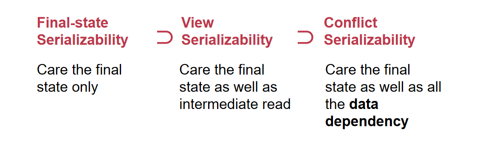

------

## 锁

### 粗粒度锁 Coarse-Grained Lock

#### 思想

* 全局持有一把锁，所有动作执行前都必须获取这把锁，执行完成/提交后释放锁。

> 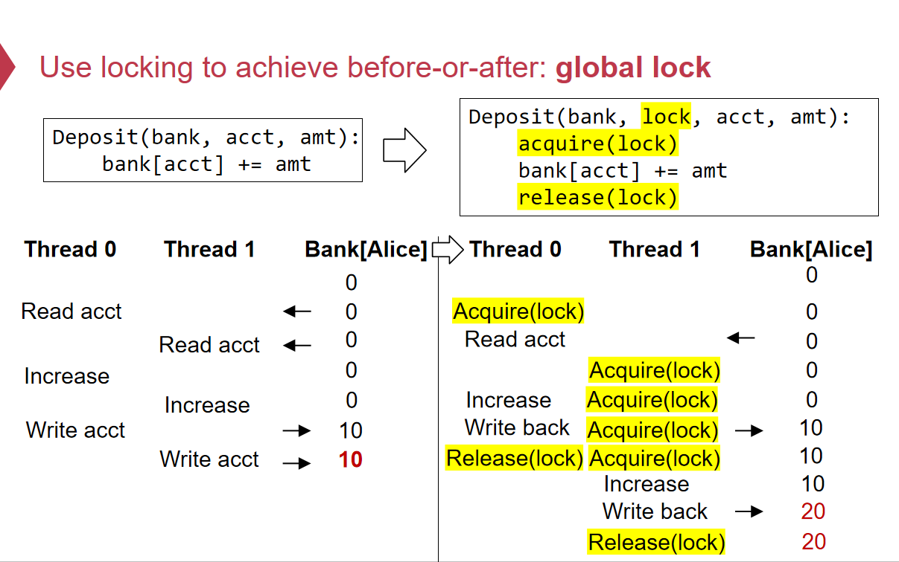

#### 优劣

* 粗粒度锁，同一时间只有一个线程可以执行操作
* 即使不共享资源的操作也无法并发执行

### 细粒度锁 Fine-Grained Lock

#### 思想

* 对于每一个共享的数据对象，都设置一把锁。
* 当需要操作某个数据对象前，先获取对应的锁，操作结束后释放锁

> 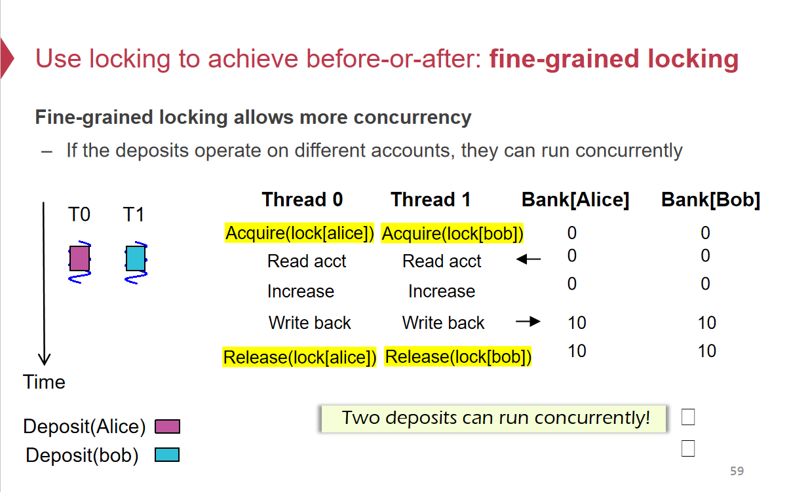

#### 优劣

* 支持并发事务。
* 不同线程访问多个共享对象，最终可能导致正确性问题，锁只保护一个数据对象的访问安全，但当需要保证隔离性的事务中涉及多个共享对象，数据使用完就立即释放锁，无法呈现出整体的隔离性。
* 对某个具体共享对象使用前获取锁，结束后立马释放锁并不能防止事务执行过程中中间状态不被外界读取。

> 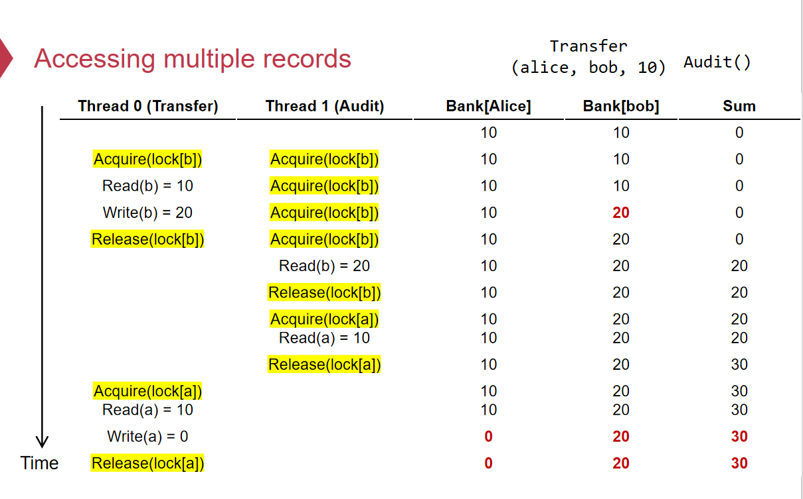

------

## Two-Phase Locking Protocol 两阶段锁协议

### 定义

对于每个共享数据，都有一个**细粒度锁**，2PL 要求对共享数据进行**操作（读 & 写）前**，必须获取对应的**细粒度锁**，直到操作结束才释放锁，并且**获取、释放必须遵循特定规则**。

2PL协议将锁的**获取和释放分为两个阶段**：

* **Growing Phase**：此阶段事务只获取锁，不会释放任何已经持有的锁。
* **Shrinking Phase**：此阶段事务只释放锁，不会再获取任何锁。

**2PL协议意味着事务中一旦开始释放锁，就不能再获取任何新的锁。**

2PL中Growing Phase获取完最后一个需要的锁的时刻称为Lock Point。

### 类型

#### Rigorous 2PL Protocol

* Rigorous 2PL Protocol要求在整个事务过程中持有不论是Exclusive Lock抑或是Shared Lock，直到**事务执行完成提交后才统一进行释放**，不能在过程中动态释放。

#### Strict 2PL Protocol

* Strict 2PL要求在整个事务过程中持有Exclusive Lock并且直到事务执行完成提交后才统一进行释放，不能在过程中动态释放。

#### Conservative 2PL Protocol(保守两阶段锁)

* 保守两阶段锁要求在事务开始时就**预先知道要访问哪些对象**，并且在事务**开始阶段就获取所有需要的锁**，然后才开始执行对对象的读写操作。

`CSE-11-before-or-after-atomicity.pptx`中提到

> **2PL Lock acquire rule**: 
>
> The action must acquire the shared data’s lock **before access it**, and release it until **all the action** finishes
>
> 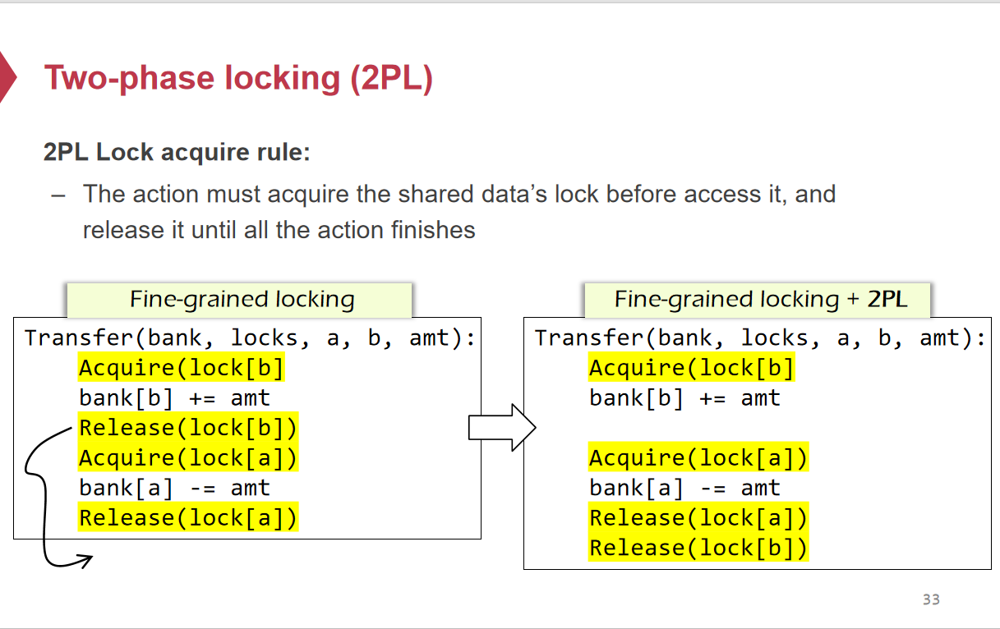

指的应该是Rigorous 2PL Protocol（严格两阶段锁协议），并且`CSE-11-before-or-after-atomicity.pptx`中并没有严格区分Exclusive Lock & Shared Lock。简单来说，`CSE`课上提到的2PL即在事务中对每一个共享的数据对象访问前必须拿到对应的锁，并且在整个事务过程中持有，直到事务所有操作结束才统一进行释放。

### 两阶段锁与可串行化

$$
采用Two-Phase~Locking的并发事务调度必定满足Conflict~Serializable\\
Proof:假设采用两阶段锁的并发事务存在一种不满足Conflict~Serializable的调度情况\\
对于调度S，因为不满足Conflict~Serializable，其中的事务必定满足冲突:
\\T_1\rightarrow T_2 \rightarrow T_3 \rightarrow ... \rightarrow T_n \rightarrow T_i(i < n)
\\即使原调度S中事务间冲突关系必定存在一个环。
\\对于任意两个事务若有T_i\rightarrow T_j,由于采用了2PL,\\T_i与T_j必定访问了某个共享对象Q，T_i先于T_j对Q进行操作，则T_i先于T_j获取Lock_Q.
\\T_j获取到Lock_Q时T_i必定已经释放Lock_Q,
\\根据Two-Phase~Locing定义，
\\T_i必定进入Shrinking~Phase,不可能再获取任意锁.而T_j必定进入Growing~Phase,正在获取锁.
\\对于T_i \rightarrow T_{i+1} \rightarrow ... \rightarrow T _n \rightarrow T_i,
\\T_i\rightarrow ... \rightarrow T_n \Rightarrow T_n进入Growing~Phase前,T_i必定进入了Shrinking~Phase
\\T_n\rightarrow T_i \Rightarrow T_n进入Shrinking~Phase后,T_i 必定进入Growing~Phase
\\T_i进入Growing~Phase后进入Shrinking~Phase,又再次进入Growing~Phase
\\根据Two-Phase~Locking定义，Growing~Phase与Shrinking~Phase不存在交织，矛盾。
\\因此采用Two-Phase~Locking的并发事务产生的调度必定满足Conflict~Serializable
$$

> 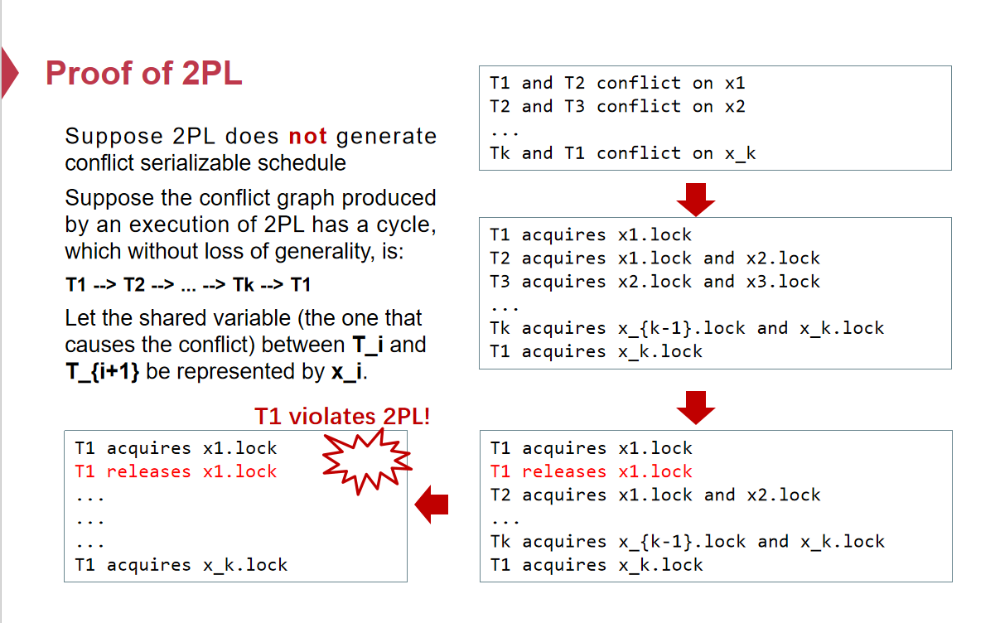

------

## Optimistic Concurrency Control（乐观并发控制）

### 场景

乐观并发控制的提出基于的场景是大多数事务为只读事务，较少的事务会对数据产生更新，而在这样的场景下对于每一个要进行读写的数据都上锁，会大大降低性能，为了进一步提高并发事务的性能，可以采用OCC。

### 定义

* Phase 1: **Read** Phase
  * **读操作**：将事务涉及的所有数据**原子读取**一份副本到**Local Work Space**，记录到Local的**Read Set**中。
  * **写操作**：将写操作结果记录到**Local Work Space**的**Write Set**中，不直接更新原始数据存储（**Buffer Write**）。
  * **写后读**：在**Local Work Space**中读取需要的数据（写操作可以在更新Local Work Space中的Write Set后同时更新Read Set中的数据 / 先读Local的Write Set，读取不到再读Local的Read Set），此时不会再读原始数据存储中的数据。
* Phase 2: **Validation** Phase
  * **检测**：检查**Local Read Set**中的所有数据在**原始数据**存储中是否**被修改**。
    * 如果被修改，**ABORT**。
    * 如果未被修改，进入下一阶段
* Phase 3: **Write** Phase
  * 提交：将**Local Work Space**中**Write Set**的所有数据**持久化**到原始数据存储（DB / File Sys / ...）中，事务提交。

### Critical Section

Phase 2 & Phase 3 需要在同一个**Critical Section**中执行（避免在检测阶段数据被修改）。

#### 全局锁

全局锁保证同一时间只有一个事务进行检测 & 提交，粒度粗，性能差。

#### 两阶段锁

* 检测阶段获取所有Read Set中涉及到的数据的锁，检测原始存储中对应数据是否被修改，若修改，ABORT。
* 写入阶段获取所有Write Set中涉及到的数据的锁，进行写入。

> 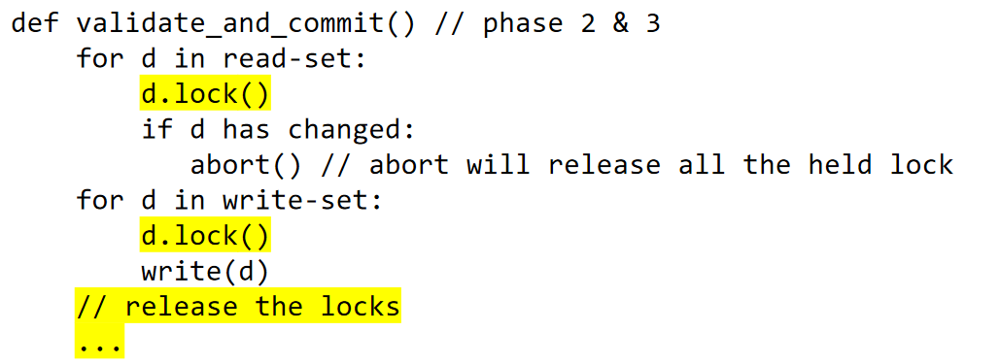

检查 & 提交阶段采用两阶段锁能够保证更好地并发性能，但需要解决两阶段锁带来的**死锁问题**。基于两阶段锁的优化：

* Phase 1会将所有需要的数据都读取到Local Work Space的Read Set中，并且所有写操作会存储在Local Work Space的Write Set中，根据Read Set & Write Set对所有数据进行一个排序，保证并发中使用2PL上锁顺序相同，避免死锁。

  > 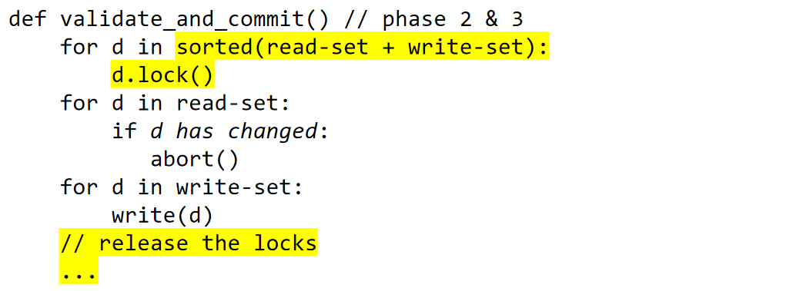

* Read Set中的数据在原始数据存储中没有被修改，即通过验证阶段。只需要获取Write Set中所有数据的锁，并且检测Read Set中的所有数据没有被上锁且在原始存储中没有被修改，即认为通过验证。

  > 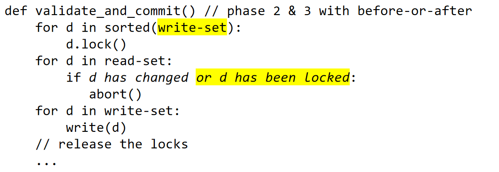

### 观察

* 在Validation阶段采用2PL并且不对读集合上锁，只锁写集合，而读集合只检测数据是否被修改以及是否被上锁。如果读集合检测到对应数据没有被上锁，但实际上在当前事务获取完所有写集合锁后、开始检测写集合前就已经发生了对读集合中数据的修改，那么必定可以检测到原始存储中对应数据项被修改，触发ABORT。
* 准确来说，检测读集合是否被上锁，检测的是是否有其他线程获取了读集合数据对应的锁，因为当前事务的写集合有可能与读集合有重合，这种情况下写集合已经获取了对应的锁，只需要检测原始存储中数据是否被修改即可。
* 如果并发事务各自涉及到的数据集合（读集合 ∪ 写集合）不相交，意味着比不可能发生冲突，可以并发执行。
* 如果并发事务读集合有重合，但是写集合不相交并且写集合与他者的读集合不交，那么也不可能发生冲突。

> 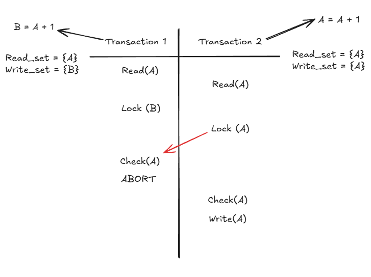
>
> ------
>
> 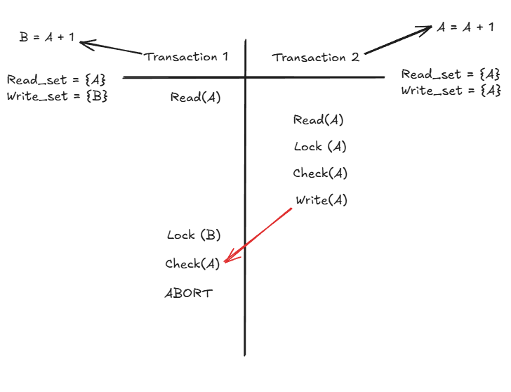
>
> ------
>
> 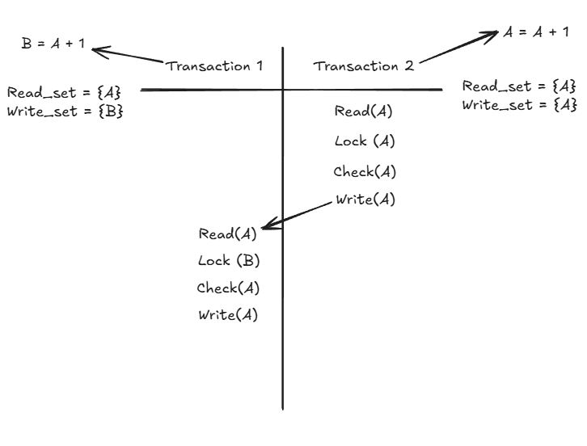

### 优劣

> 懒得写了直接贴一张`CSE-12-TX.pptx`中的截图
>
> 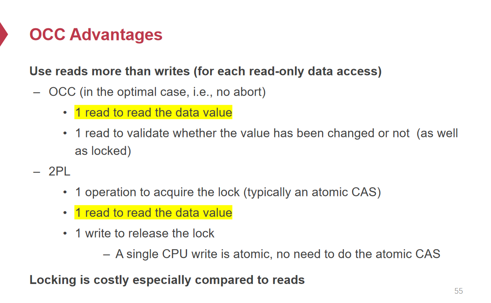

* False Abort：如果两个并发事务按照2PL可以满足Conflict Serializability也可能导致OCC ABORT。

  > 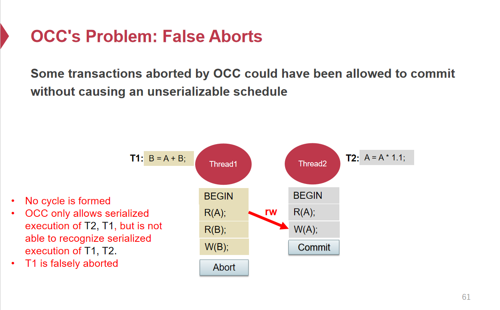

* Live Lock：对于长时间进行的事务，有可能因为大量的短时间事务对其读集合对应的原始存储不断进行修改提交，而使得长时间运行的事务不断ABORT而无法成功，最终出现饿死的现象。在这种情况下需要一些调整，比如说阻塞住短时间事务来保证长时间事务的运行。

### All In One

> From `CSE-12-TX.pptx`
>
> 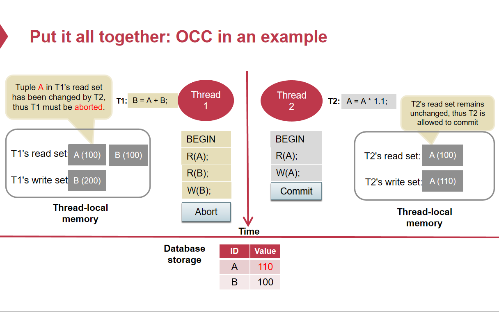

------

## Multi-Version Concurrency Control 多版本并发控制

### Snapshot Isolation

#### 定义

在多版本并发控制中，每个数据都存储多个版本，每个版本用一个版本号来唯一标识，每次对数据进行写入时并不会覆盖过往版本的数据，而是创建一个新的版本号的数据，在进行读操作时，会获取到满足一定条件的版本号下的数据。

对于每个事务*T~i~*：

* 事务开始时获取一个起始时间戳***StartTimeStamp(T~i~)***

* **Concurrent Local Processing** #Phase 1
  * **读数据**时，读取该数据项距离***StartTimeStamp(T~i~)***最近的版本的数据，即要满足***VersionTimeStamp(data)*** ≤ ***StartTimeStamp(T~i~)***的**最近版本**的数据。（相当于对所有需要读取的数据进行了一次**快照**，保证只读到 *T~i~* 开始前**已提交事务的数据**，未提交事务的数据不读取）
  * **写操作**在**Local Private Workspace**中进行，构成一个Local Private Workspace中的**Write Set**。
* 事务在Local Private Workspace中的操作完毕，准备提交，获取一个提交时间戳***CommitTimeStamp(T~i~)***
* **Commit Results in Critical Section**
  * 对于Local Private Workspace中Write Set所有涉及到的要写入数据项，**获取写锁**，保证提交的原子性。
  * **Validation** #Phase 2：检测对于Write Set中所有要更新的数据项Q，
    * 若***LatestVersionTimeStamp(Q)*** > ***StartTimeStamp(T~i~)***，则表明过程中存在**并发事务**进行了**提交**且与当前事务有冲突，**ABORT**。
    * 若***LatestVersionTimeStamp(Q)*** < ***StartTimeStamp(T~i~)***，表明**没有并发事务提交**，当前事务可以进行提交。
  * **Update** #Phase 3：对于Write Set中的所有数据项检测完毕，将Write Set真正写入原数据存储，事务提交，新写入的数据并不会直接覆盖原始数据，而是创建一个**版本时间戳为*CommitTimeStamp(T~i~)*的数据**。

#### 细节

* 对于StartTimeStamp & CommitTimeStamp的获取一般会采用一个递增的逻辑时钟，而对于这个时钟的访问需要保证原子性，可以采用原子操作 `Fetch & Add`保证每次获取到的时间戳全局唯一并且递增。

* 在读取数据时，为了保证不会获取到别的事务提交过程中的数据，需要在读取版本数据时保证对应的数据没有被写锁定。

  > 提交的中间数据被读取到，事务提交呈现出非原子性的情况，并发事务提交的中间数据被读到意味着获取到的快照包含没有完全提交的数据。
  >
  > 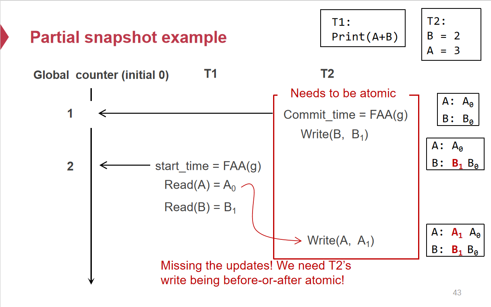

* MVCC中并发事务是在各自获取到的快照的基础上进行操作，彼此无法看到对方事务过程中的更新。如果不对并发事务的提交加以约束，就会出现数据写入竞态。因此需要在提交阶段对Write Set中的每一个数据进行检查，保证在此事务提交时没有别的事务在并发进行提交。

  > 从隔离性的角度来看，并发事务应当呈现Before & After Atomicity，也就是说要么T~1~先执行完毕后执行T~2~，要么T~2~先执行完毕后执行T~1~。而这里因为并发提交，二者操作基于的快照数据状态也一致，最终数据呈现的状态违反隔离性约束下的并发事务执行。
  >
  > 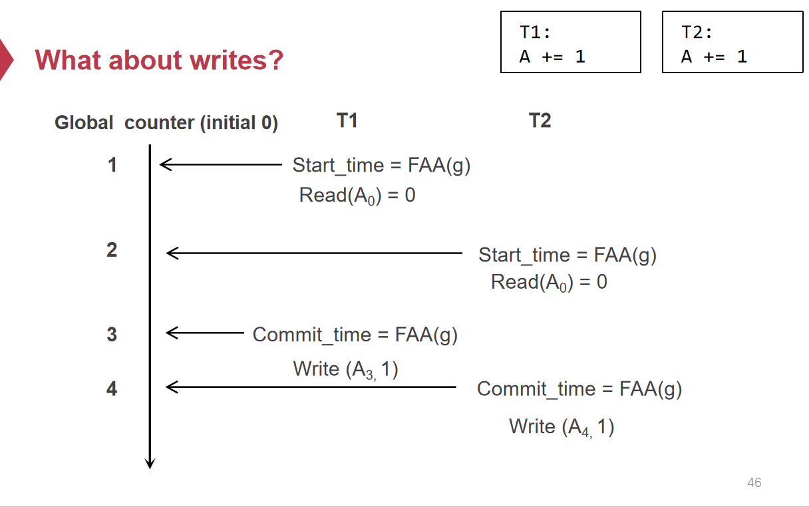

* MVCC并不保证Serializability。

  > * Write Skew Case
  >
  > 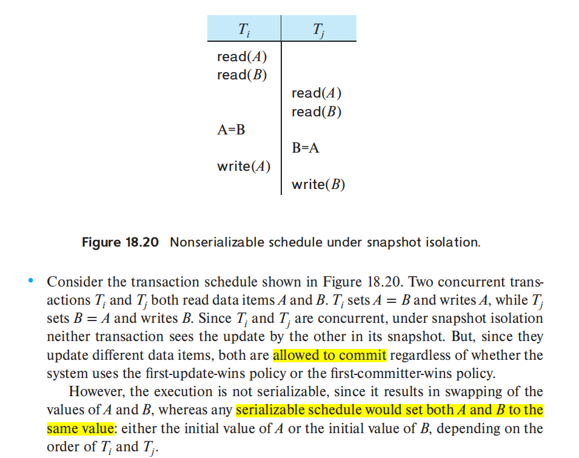

------

## 参考

* [Categories of Two Phase Locking (Strict, Rigorous & Conservative) - GeeksforGeeks](https://www.geeksforgeeks.org/categories-of-two-phase-locking-strict-rigorous-conservative/)

* [Two Phase Locking (2-PL) Concurrency Control Protocol | Set 3 - GeeksforGeeks](https://www.geeksforgeeks.org/two-phase-locking-2-pl-concurrency-control-protocol-set-3/)

* [Transaction management：两阶段锁（two-phase locking） - 知乎](https://zhuanlan.zhihu.com/p/59535337)

* 《深入理解分布式系统》,唐伟志

* CSE-12-TX.pptx