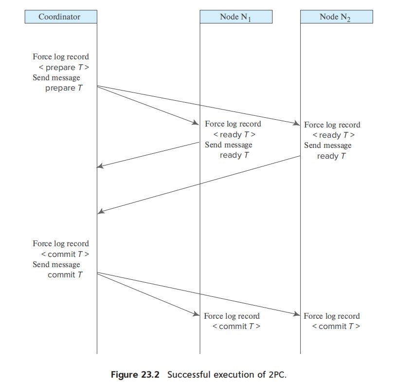
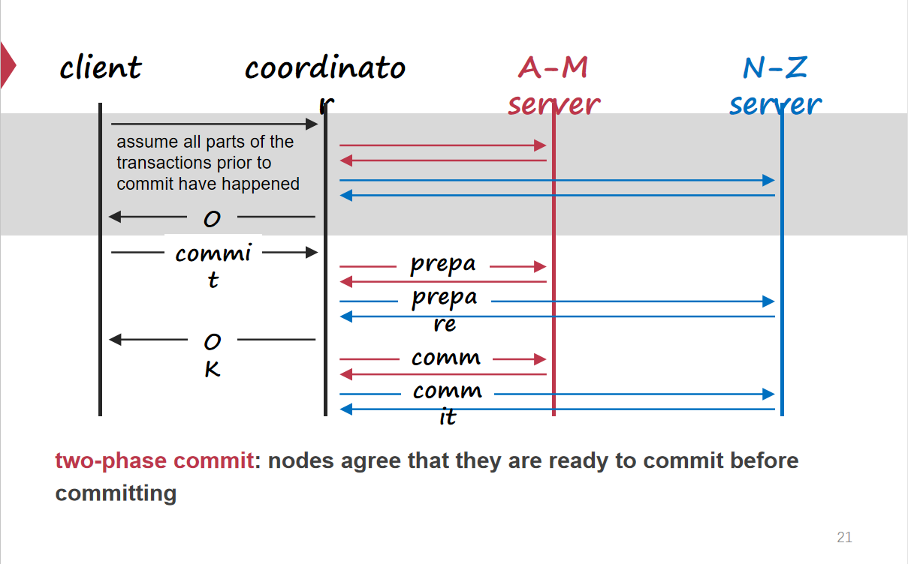
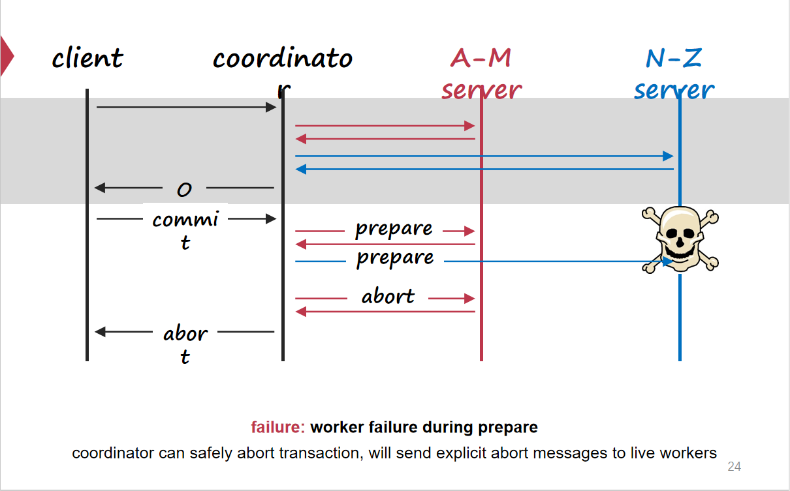
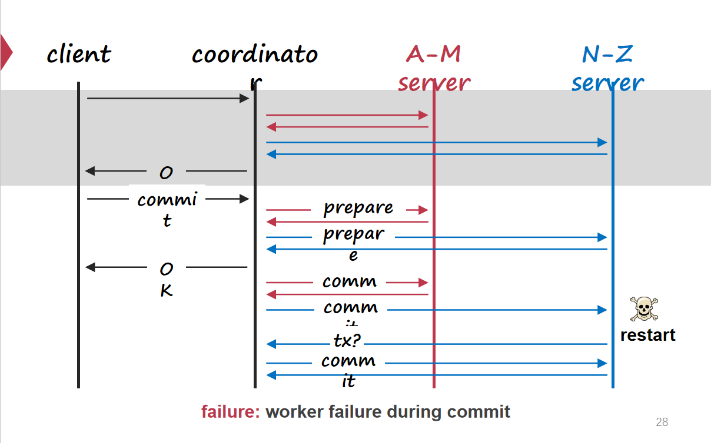
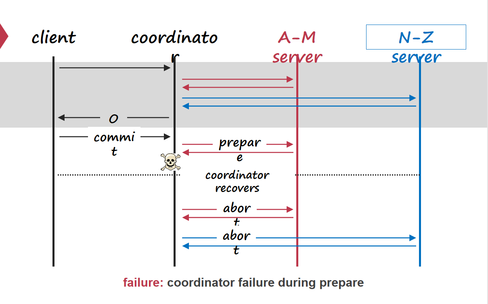
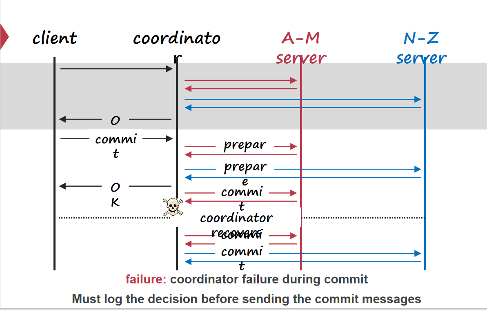

# Distributed Transaction

## Two-Phase Commit

### Multi-site

大量数据分散在多个机器节点上的数据库，需要进行跨节点的事务执行，单台机器上的数据库能保证自身事务的ACID，但是整个分布式环境下跨界点的事务原子性无法支持。

需要保证跨节点执行的分布式事务能够保证原子性，要么全部提交，要么全部终止。

### High-level  & Low-level Transaction

* High-level Transaction：跨节点分布式事务本身
* Low-level Transaction：单台机器上执行的事务

可以将跨节点执行的分布式事务认为是High-level Transaction中内含多个Low-level Transaction。

所有Low-level Transaction提交，则High-level Transaction提交；存在Low-level Transaction ABORT，则High-level Transaction ABORT且所有Low-level Transaction ABORT。

分析分布式事务，将分布式事务拆分成High & Low进行分析，High-level Transaction调用多个单节点中的Low-level Transaction并决定整体分布式事务提交状况。

### Node

* Coordinater：负责统一决定分布式事务 Commit / Abort
* Worker：执行具体的事务并由Coordinater进行裁决事务是否提交。

### Log

在单机系统上，事务提交的标志是在日志中记录一条<Commit T>日志条目。分布式事务如果让各个Worker Server事务执行完毕直接在日志中记录<Commit T>就会导致部分机器提交而部分机器不提交的情况，所以需要各个Worker Server中事务执行完进入一个Tentative Commit状态，日志中记录描述Tentative Commit的条目，等待统一决定。

2PC要求Coordinater & Worker都必须记录日志。

### Protocol

协议需要解决的核心问题是：High-level Transaction下的Low-level Transaction之间提交状况可能不一致。即协议需要保证所有Low-level Transaction最终呈现出的状态是要么全部提交，要么全部终止。

可以认为分布式事务中涉及的节点分为两种：Coordinater & Worker。

分布式事务开始执行时，Coordinater调用各个Server开始在各自机器上执行事务，当所有机器执行完毕时，开始决定是否提交：

* Phase-1：Prepare / voting
  * Coordinater发送 Prepare 信息到所有 Server 查看对应Server中执行的事务是否可以提交( COMMIT / ABORT ）
  * Server收到Coordinater发送来的信息，如果本机上执行的事务可以提交，则日志中记录Tentative Commit状态，否则日志中记录Abort状态。
  * 每个Server返回给Coordinater COMMIT / ABORT的信息。
* Phase-2：Commit / Abort
  * Coordinater收到所有Server返回的消息，如果所有Server都可以Commit，则Coordinater发送Commit消息到所有Server，进行提交；如果有Server为ABORT，则Coordinater发送ABORT消息到所有Server，回滚事务。

### More Concisely

* Phase-1
  * Coordinator日志中记录<Prepare T>标志开始Prepare阶段
  * Coordinator发送Prepare T Message 到所有 Server
  * Server收到信息
    * 如果事务可以提交，Server中日志记录<Ready T>标志该Server进入准备状态
    * 如果事务不能提交，Server中日志记录<No T>标志该Server不能提交。
  * Server根据事务是否可以提交，返回Coordinator消息
    * 如果事务可以提交，返回Ready Message给Coordinator
    * 如果事务不能提交，返回Abort Message给Coordinator
* Phase-2
  * Coordinator根据收到的响应消息决定事务是否提交
    * 如果Coordinator收到所有节点的消息且都为 Ready Message，则分布式事务可提交，Coordinator日志中记录<Commit T>
    * 如果Coordinator收到一条为Abort Message的响应，则分布式事务不能提交，Coordinator日志中记录<Abort T>
  * Coordinator根据结果发送消息到所有Server
    * 如果事务可以提交，则对每个Server发送<Commit T>
    * 如果事务不可提交，则对每个Server发送<Abort T>
  * Server收到消息，在Server的日志中进行记录，并进行 Commit / Abort。

### 故障

#### Worker Node Failure

##### Case

* 工作节点在发送响应 Ready T 至 Coordinater前故障，这与工作节点向Coordinater发送Abort T的响应效果是一致的，所以Coordinater检测到Worker Node故障，直接决定Abort T，发送至所有节点。
* 工作节点在Coordinator收到 Ready T之后故障，这并不会影响Coordinater裁决分布式事务的提交状态，Coordinator按照流程进行裁决即可。

##### Recovery

工作节点重启后，由于不知道执行到哪一个阶段崩溃的，需要查看日志。

* 如果日志中包含<Commit T>，意味着对于事务T，Coordinator已经做出了提交的决策，则工作节点Redo(T)。
* 如果日志中包含<Abort T>，意味着对于事务T，Coordinator已经做出了Abort的决策，则工作节点Undo(T)。
* 如果日志中包含<Ready T>，意味着当前工作节点并不知道Coordinator的决策，但事务已经执行完，需要决定是否提交
  * 如果Coordinator运行正常，工作节点发送消息到Coordinator查询关于T的提交裁决，并依次进行恢复。
  * 如果Coordinator宕机，工作节点可以查询其他工作节点(Warn:CSE中未提及，认为所有的裁决查询都应该通过Coordinator，实际上有一些情况下是可以查询其余工作节点)。
    * 如果有工作节点中包含<Commit T>，意味着对于事务T，Coordinator已经做出了提交决策，则Redo(T)
    * 如果有工作节点中包含<Abort T>，意味着对于事务T，Coordinator已经做出了Abort决策，则Undo(T)
    * 如果所有节点都没有<Commit T> / <Abort T>，意味着对于事务T，暂时无法决定提交状态，只能等待，期间定期发送消息给Coordinator / 其他工作节点不断询问。
* 如果日志中对于<Ready T> <Abort T> <Commit T>均不包含，意味着没有准备就已经故障了，按照算法，Coordinator会认为这个分布式事务应当Abort，所以Undo(T)进行恢复即可。

#### Coordinator Node Failure

##### From Coordinator View

* 如果Coordinator在Prepare阶段崩溃，重启之后可以直接决定Abort T。
* 如果Coordinator在Commit阶段崩溃，因为进入Commit阶段Coordinator保证日志中记录Commit T / Abort T的记录，查看日志，并发送消息到所有工作节点即可。

##### From Worker Node View

* 保守起见，当Coordinator崩溃时，工作节点等待其恢复并发送消息来决策是否提交即可。

* 在有节点已经包含裁决信息的情况下是可以通过询问（Warn:CSE中未提及，认为所有的裁决查询都应该通过Coordinator，实际上有一些情况下是可以查询其余工作节点）

  * 如果存在工作节点包含<Commit T>，意味着分布式事务T已经被Coordinator裁决过，必须提交

  * 如果存在工作节点包含<Abort T>，意味着分布式事务T已经被Coordinator裁决过，必须放弃

  * 任何节点都没有裁决信息，意味着必须等待Coordinator重启进行裁决。

#### RPC Failure

* Retry...

> CSE课程中简化了2PC的场景，所有工作节点是否提交必须直接从Coordinator来获取信息，不能通过与其余工作节点通信来获取裁决信息。
>
> * 工作节点故障
>
> 
>
> ------
>
> 
>
> ------
>
> 
>
> * Coordinator故障
>
> 
>
> ------
>
> 
