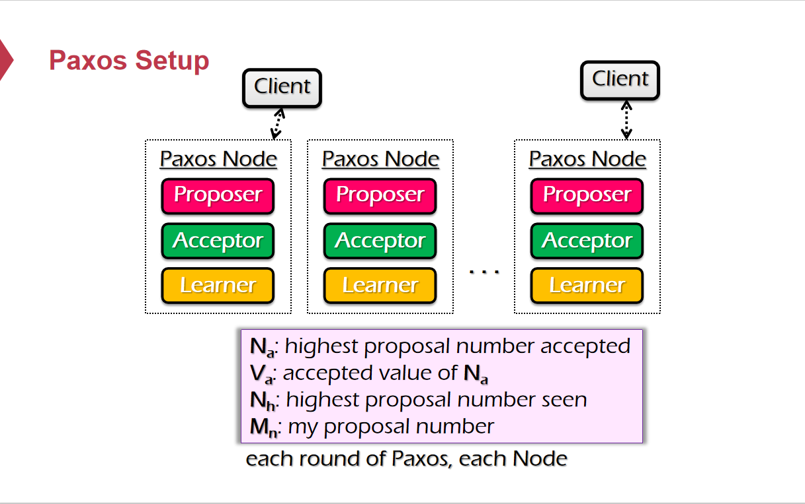
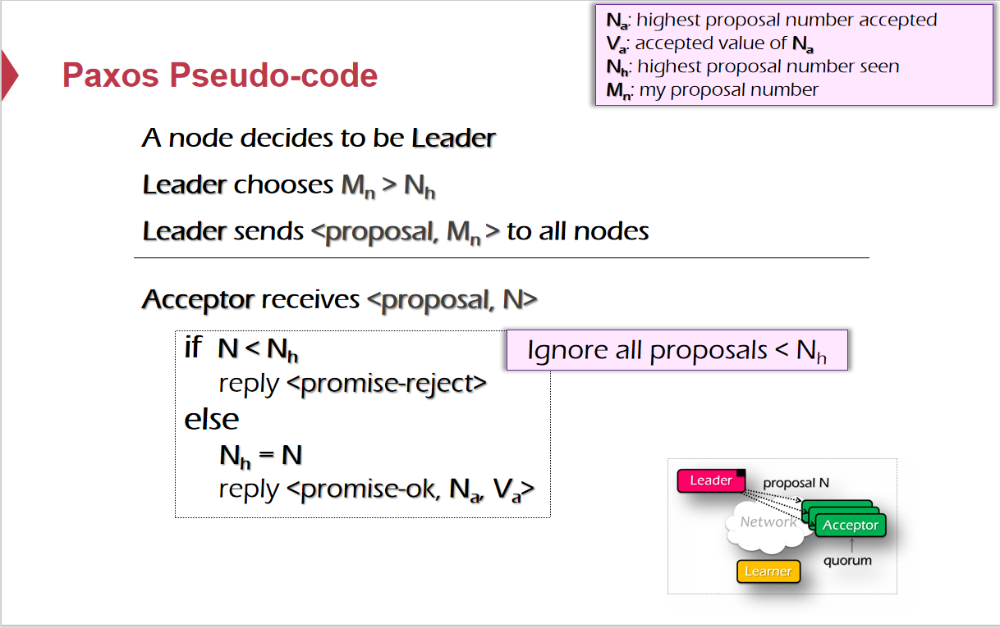
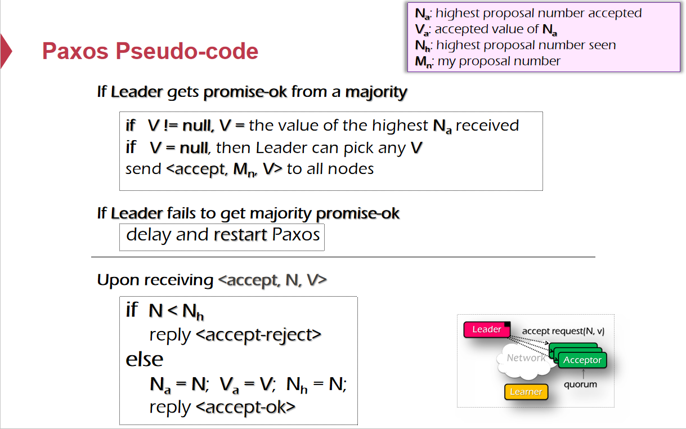
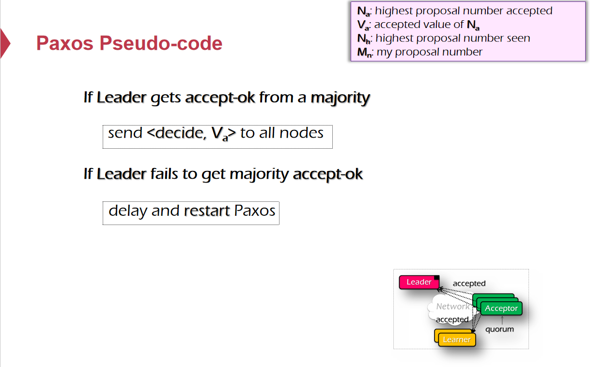
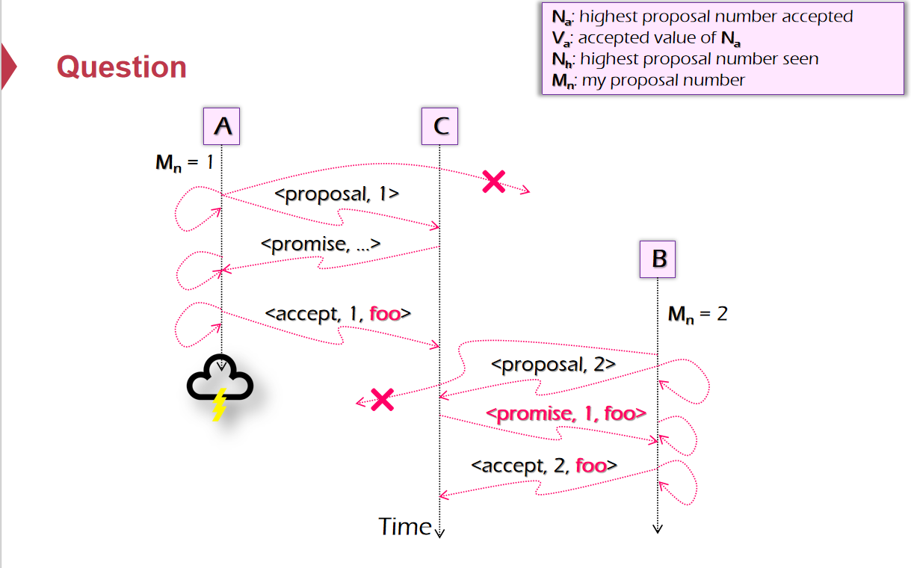
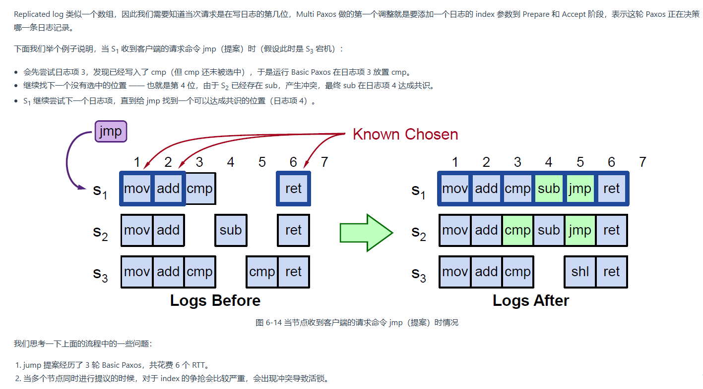

# Paxos

## Basic-Paxos

### Role

Paxos将算法抽象出三个Proposer、Acceptor、Learner逻辑上的角色，而实际上一个节点可以包含多个角色。

* Proposer：接受Client的请求并负责发起Proposal，来使得分布式环境中对某个Proposal Value达成一致，这个Value可以是任何对象。

* Acceptor：Acceptor会记录过往Proposal的一些状态，并对Proposer发来的Proposal进行投票，决定承诺/接受/拒绝Proposal。

* Learner：当分布式环境中对某个Proposal达成一致时，Learner负责执行具体的行为，并返回响应给Client。

  

### Proposal

* Proposal是一个抽象的概念。
* 当Proposer提出一个Proposal时，意味着希望分布式系统中能够就某一个Value达成一致，Value可以是任何东西的抽象。
* 在分布式环境中，机器可能会宕机，网络可能不稳定，所以最终分布式系统就某个Value达成一致时，会经过多轮的Paxos Round，每一轮的Proposal都用唯一的ID来标识，因此一个Proposal会包含<Proposal ID , Value>，Value是这个Proposal唯一对应的、希望这个系统达成共识的值。
* Paxos包含多个Round，每个Round又包含多个Phase。Paxos Round是异步的，所以不需要节点之间同步时钟，当前Role收到一个来自Round j + 1的消息而自己处于Round j或是一个更小的Round，就必须抛弃小于 j + 1的Round，将Round更新到 j + 1。Paxos Phase也是异步的。
* 只要分布式系统中大多数Acceptors接受了这个Proposal，就认为这个系统对这个Proposal对应的Value达成了一致。

### Paxos Round

#### Phase 1.a. Prepare

某一Proposer收到来自Client的请求，于是Proposer成为这一次Paxos Protocol Run的Leader：

* Proposer提出Proposal N并将Proposal发送给规定数量(Quorum)的Acceptors。
* Quorum至少大于半数机器，保证Majority。
* 发送出的信息只包含Proposal的ID N。此时从Leader的角度看来，Proposal N对应的Value未知。
* 一般来说，Proposer与Acceptor于同一节点时，保证N > N~highest~，即保证新的Proposal的编号比已经见过的大。

#### Phase 1.b. Prepare

Proposer发送消息到的Quorum中的Acceptor，记该Acceptor先前见到过最大的Proposal Number为 N~highest~，先前Accept过的最大的Proposal Number为 N~accepted~，先前Accept过的最大Proposal Number对应的Value为V~accepted~：

* 如果Proposer发来的Proposal Number N ≥ N~highest~，Acceptor就承诺(Promise)之后会忽略所有Proposal Number小于 N 的Proposal（N~highest~ ← N），并且返回<N~accepted~，V~accepted~>给Proposer（V~accepted~可能为空，意味着之前尚未接受过任何值）。
* 如果Proposer发来的Proposal Number N ＜ N~highest~，Acceptor直接忽略该Proposal或返回拒绝(Reject)。

如果未收到大部分Acceptors的Promises，则Restart。

#### Phase 2.a. Accept

* Leader收到大多数(Majority，半数以上)的Acceptors发来Promises，其中每个Acceptor发回来的Promise都会附带有<N~accepted~，V~accepted~>，根据Promises来决定Proposal N需要达成一致的Value：
  * 如果所有V~accepted~为空，则Leader自己决定一个Value。
  * 如果有V~accepted~非空，在所有非空V~accepted~中选择N~accepted~最大的V~accepted~作为Value。
* Value选定，Proposer将Proposal发送给规定数量(Quorum)的Acceptors。
* 此阶段发出的Proposal包含<Proposal Number N,Value>，且发向的Acceptors集合不要求与Phase 1.a中发向的Acceptors是同一集合。

#### Phase 2.b. Accept

* Proposer发送<Proposal Number N,Value>到的Quorum中的Acceptor，记该Acceptor先前见到过最大的Proposal Number为 N~highest~，先前Accept过的最大的Proposal Number为 N~accepted~，先前Accept过的最大Proposal Number对应的Value为V~accepted~：

  * 如果 Proposal Number N ≥  N~highest~，则接受该值，返回接受(Accepted)到Leader。

    （N~highest~ ← N,N~accepted~ ← N，V~accepted~ ← Value）

  * 如果 Proposal Number N ＜ N~highest~，则忽略该Proposal或返回拒绝(Reject)。

#### Phase 3 Learn

* Leader收到大多数Acceptors的Accepted，发送达成一致的值到所有节点。

* Learners根据分布式系统中达成一致的值，执行操作，返回响应给Client。

#### Paxos Pseudo Code

> 
>
> ------
>
> 
>
> ------
>
> 
>
> ------
>
> 

### 细节

#### 为什么Acceptor总是要Accept具有更大Proposal Number的Proposal而不是只接受第一个Proposal，拒绝剩下的？

如果Acceptor只Accept自己接收到的第一个Proposal，因为Paxos Round是异步的，可能同一时间存在多个Proposer试图称为Leader，每个Leader都会向超过半数的Acceptors发送Proposal，并发的情况下很有可能系统中一直不存在半数Acceptors持有的Proposal Number一致，这就意味着系统中一直无法达成共识。

#### 是否最终可能产生多个Leader？

Basic-Paxos确实可能导致同一时间多个Proposer在发起Proposal试图称为Leader，但最终最多只有一个会成功。

因为提出Proposal的Proposer需要向半数的Acceptors发送消息，根据鸽巢原理，两个Proposer发向的Acceptors必定有交集，意味着即使多个Proposer提出Proposal，最终只有一个会成功被系统中的半数Acceptors接受。

多个Proposer并行的发起Proposal的流程会导致冲突频繁，Paxos执行成本很高。

#### 系统中哪一时刻就某一值达成共识？

当大多数(超过半数)的Acceptors中接受的Proposal一致。

当Leader收到大多数Acceptors发送回来的<accepted,...>时必定达成一致，然而实际上在更早的时候系统中就会达成一致。比如说当大部分Acceptors接受的Proposal已经一致，但是发送<accepted,...>至Leader时出现故障、网络问题等，最终Leader没有收到大多数Acceptors发回的接受信息，但系统中大部分Acceptors的存储中接受的Proposal实际是一致的，接下来无论如何提出新的Proposals，其需要达成一致的值必定是大部分Acceptors已经存储的一致的Value。

原因显然：当需要提出新的Proposal时，必须发送Proposal Number至半数以上Acceptors，如果这个Proposal是“最新的”，即其Proposal Number不会被Acceptor否定，则必定会有一台Acceptors返回先前尚未显式在Leader中达成一致的Value（从上帝视角已经保证系统中共识达成的那个值），那么新的Proposal需要达成共识的值，就会被设置成这个Value。

#### Acceptor发送Promise至Proposer后可能故障，需要持久化哪些数据？

* 已经见过的最大的Proposal Number。

#### Acceptor接受到从Proposer发来的Accept之后可能故障，需要持久化哪些数据？

* 已经见过的最大的Proposal Number。
* 已经Accept的最大的Proposal Number。
* 已经Accept的Proposal Number最大的Proposal对应的Value。

> 

#### Learner是否必要？

- Learner 的主要作用是监听共识结果。它可以在协议完成达成一致时获取最终的决定（Decide）。
- 在有 Learner 的情况下，Proposer 不需要将结果广播给每个节点，发送给Learner即可。Learner 会直接返回结果给客户端，减少了通信的复杂度。
- 如果没有 Learner，客户端要获取到最终的共识结果，就必须额外运行一轮 Paxos 协议。这是因为在 Paxos 中，达成一致的值只会在超过半数的 Acceptors 接受同一个提议时就最终确定，后续的轮次不会改变这个决定值。所以，即使没有 Learner，客户端仍然可以通过重新发起一个 Paxos 协议来查询到最终结果。Learner简化了获取共识的流程。

------

## Multi-Paxos

### Multi-Instance

* 一个Paxos Protocol Instance只能就一个值达成共识，共识后不会变化。
* 简单地通过启动多个Paxos Protocol Instances就可以对多个值来达成共识。
* 启动多个Paxos Protocol Instances消耗资源

### Replicated Log

* 用一个日志数组，通过Index来指明在日志的哪一个位置进行写入。
* 在Paxos运行过程中，用Index来表明要就哪一个日志位置的值达成共识，即可完成对多个信息的共识记录。
* 同一个Index位置一旦被使用，达成共识，之后不会再发生变动。

### Leader Election

**Multi-Paxos** 通过引入 **Leader** 来简化协议并避免不必要的重复 **Prepare** 阶段。在 **Leader** 的机制下，**Proposer** 的角色由单一的 **Leader** 执行，且它会持续地发起提议，而不需要每次都通过 **Prepare** 来重新获得多数 **Acceptors** 的同意。

* **Leader** 被选举出来后，它可以代表整个系统发起提议，不会有其他Proposer来发起协议（概率很小）。

* **Leader** 发起提议时，它直接使用它自己递增的**Proposal Number**向 **Acceptors** 提交提议。

* 由于 **Leader** 一直保持相同的提议编号和身份，**Acceptors** 不需要重新进行 **Prepare** 阶段的交互，**Leader** 可以直接进行 **Accept**，并确保多数 **Acceptors** 会接受这个提议。

选举方法有很多种，Lamport 提出了一种简单的方式：让 server_id 最大的节点成为Leader。

* 既然每台服务器都有一个server_id，我们就直接让server_id最大的服务器成为Leader，这意味着每台服务器需要知道其它服务器的 server_id。
* 节点之间通过心跳机制保证Leader存在。如果一个节点在一定时间内没有收到比自己server_id更大的心跳，那它自己就转为 Leader，
  * 只有Leader处理Client的请求
  * 只有Leader来发起Proposals
* 如果一个节点收到比自己 server_id 更大的服务器的心跳，那么它就不能成为 Leader，
  * 该节点拒绝掉客户端请求，或者将请求重定向到 Leader
  * 该节点只能担任 Acceptor

值得注意的是，这是非常简单的策略，这种方式系统中同时有两个 Leader 的概率是较小的。**即使是系统中有两个 Leader，Paxos 也是能正常工作的，只是冲突的概率就大了很多，效率也会降低。**
