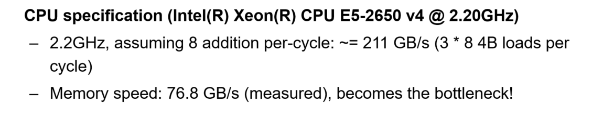

# Computation Device

## 传统单核CPU

### 流水线

* 基于流水线，最多一个时钟周期吐出一条指令
* 算力上限在于 clock rate，即时钟频率，然而实际情况下难以达到性能上限
  * 指令之间会存在依赖，因此流水线中会存在bubble以规避依赖问题
  * 存在多周期指令

### 超标量

* 一次性执行多条指令，同时发射多条指令 
* 前提在于没有数据/控制依赖关系 data hazard / control hazard，如果同时发射的多条指令存在依赖就是无效的计算
* 超标量无法做到非常高

### 提升主频

* 硬件散热问题
* 摩尔定律失效

## 并行化计算

### 多核

* Cash Coherence Problem：多核处理器中各个核心都会有各自的缓存，多个核心同时读写同一内存位置时，它们的缓存行都会缓存对应的数据。某个核修改了一个数据，会修改其缓存中的数据，但是不一定会立马写回到内存，而此时另一个核缓存中也有对应的数据，但是没有被修改，出现了缓存不一致的现象。

* Coherence Protocol
  * Snoop-Based Protocol：某个核心要读写某个内存位置的值时，广播该请求，复杂度随着核数增加而线性提升
  * Directory-Based Protocol：使用一个全局的目录来跟踪每个缓存行的状态，该目录会成为性能瓶颈

### 增加ALU器件

* 单个CPU中增加ALU器件的数量，但能增加的数量受制于芯片面积等硬件层面因素

### SIMD

* Single Instruction，Multiple Data

* 在拥有多个ALU器件情况下，可以通过特殊的指令，一条指令执行多个浮点操作，在对大量数据进行计算的场景下可以加速计算

* 代码层面需要通过特殊的指令来使用SIMD

* ```pseudocode
  Load A[i,i+8]
  Load B[i,i+8]
  Compute A[i,i+8] + B[i,i+8]
  Store C[i,i+8]
  ```

  假设使用SIMD同时进行长度为8的向量计算，在计算大量数据的情况下，理论上期望运行时间应该是原本的1/8，然而实际是原本的1/2，实际上此时访存成为了性能瓶颈。

  

* SIMD与控制流：采用掩码来达成数据上的“控制流”。代价是所有分支必须被执行一遍，带来额外的计算，浪费性能。

### SIMT

## Roofline Model

### 访存

* 在单核CPU流水线中，期望一个时钟周期就能吐出一条指令
* 然而实际的访存指令，如果对应数据不在缓存行中，一次访存需要至少100+的时钟周期

#### 影响因素

* Memory Latency：时延，衡量一次访存操作的时间
* Memory Bandwidth：带宽，衡量从内存到处理器可以传输的数据大小

#### 访存 α-β Model

* Load Data Time = Latency + Payload / Bandwidth
* 对于CPU Load / Store 操作，主要瓶颈在于Latency
* 对于大量数据传输，主要瓶颈在于Bandwidth

### Roofline Model

* Y轴：Attainable Performance，刻画算力，每秒钟能做多少浮点计算（eg.每秒进行多少个浮点数计算）

* X轴：Operational Intensity，刻画访存能力，平均读取1字节可以进行多少次浮点计算。

* 斜率：刻画当前带宽需求，每秒需要读取多少字节。一条从(0,0)处开始的斜线其斜率表征系统最大内存带宽。

* 计算强度：刻画一个核的计算需求于访存带宽需求之间的比例。计算强度构成一条平行于Y轴的直线，对应的X轴值就是计算强度大小。
  $$
  Arithmetic \ Intensity = 
  \
  \frac
  {总算术运算次数 \ (FLOPs)}
  {总数据传输量 \ (Bytes)} 
  \
  $$

* 屋檐 & 屋顶：根据计算强度可以得知当前模型的瓶颈是内存带宽瓶颈还是计算瓶颈。当计算强度落在带宽斜线之下时，说明当前是内存带宽瓶颈；当计算强度落在最大算力直线之下时，说明当前是计算瓶颈。

