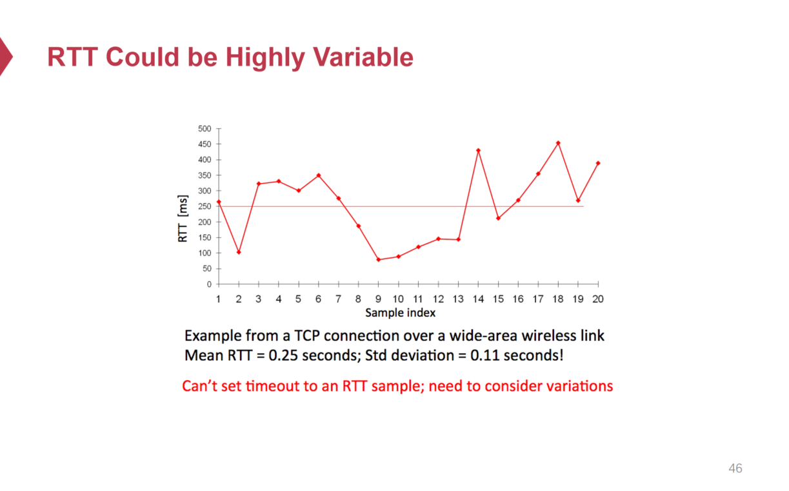
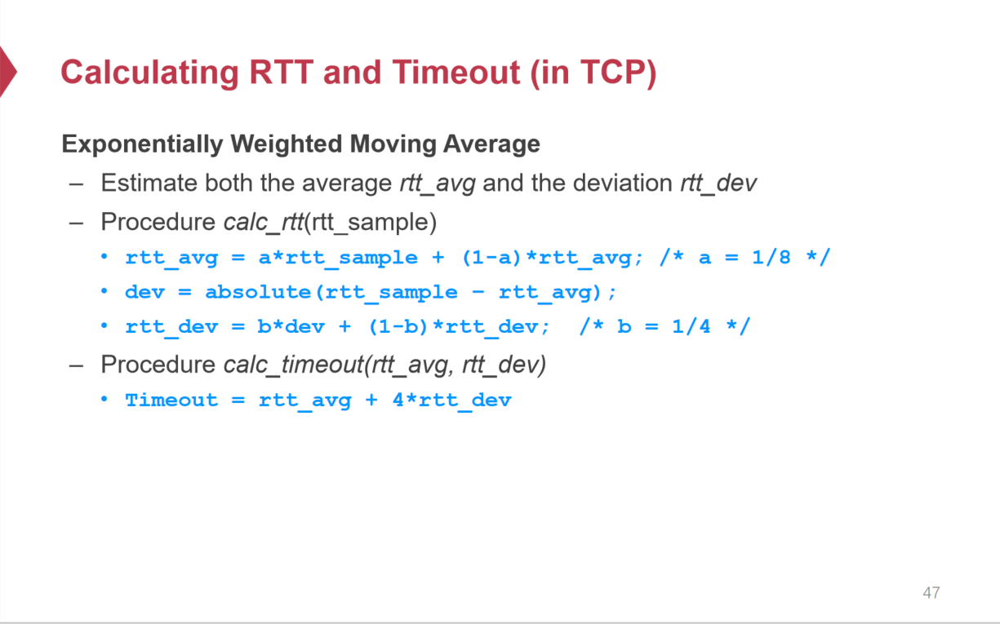
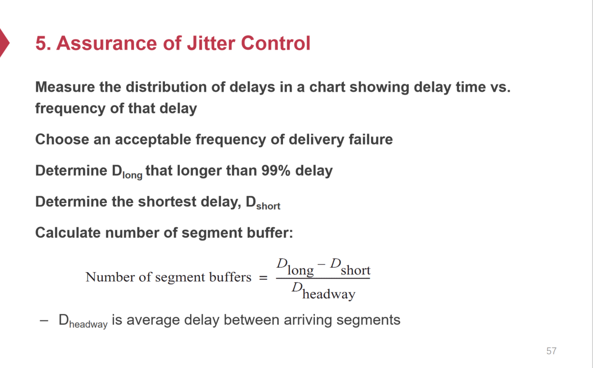
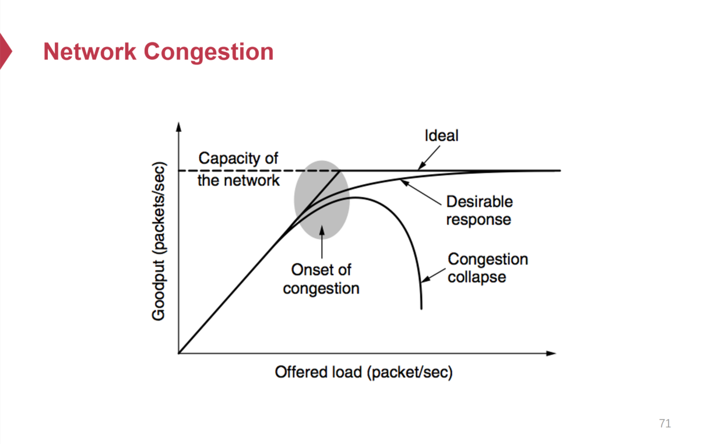
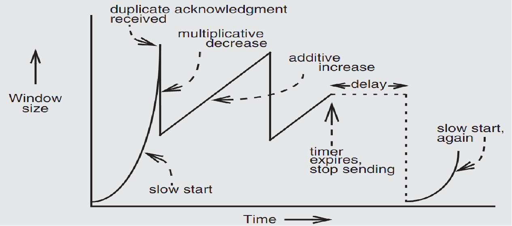
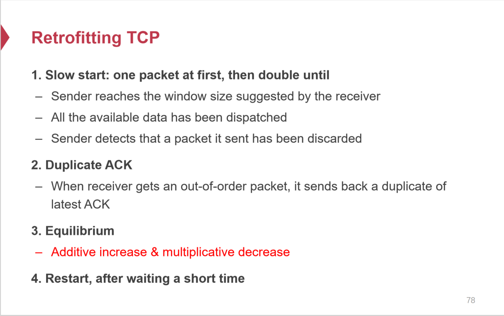
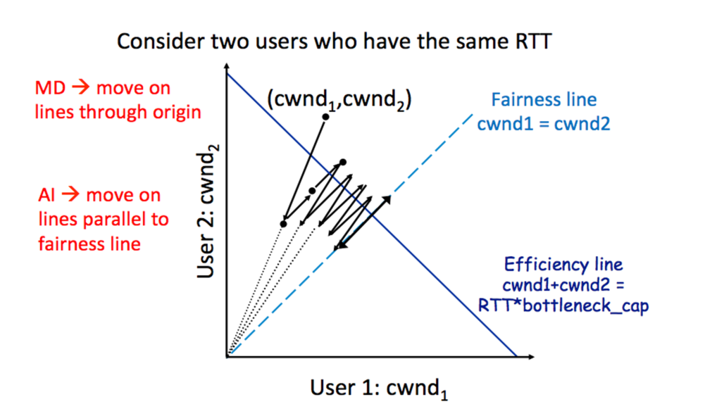

# End-to-End Layer

## 为什么需要End-to-End Layer

Network层主要负责将数据包在网络中的一端传递向网络中的另一端，而Network层对于数据包发送的时延，数据包的接受顺序，内容正确性等并没有保证，需要更上层对这些进行控制。

## 传输层协议

* UDP：UDP传输协议不需要发送方和接收方建立连接就可以直接传输数据，这意味着UDP不保证数据的送达，不处理丢包情况，更无法保证数据包的顺序。由于传输机制简单，UDP的传输延迟低。

* TCP：TCP传输协议需要在发送数据包前发送方和接收方建立连接（“三次握手”），TCP传输协议可以保证数据包的顺序传输，处理丢包情况，可以应对网络拥塞的情况。
* RTP：基于UDP的面向流式数据（视频、音频等）传输的传输协议。

## 传输协议需求

### 保证 at-least-once 传递

#### Timeout & Retry

* RTT（Round-Trip Time）用来衡量数据发送方发出数据包、接收方接受数据包并返回响应，发送方收到响应这一往返流程的所需时间。可以认为RTT = to_time + process_time + back_time(ack)，即发送方发出数据包到收到ACK包之间的时间。

* 当一次数据传输出现问题时，数据发送方无法确定是这次通信中哪一环节出现了问题，可能存在一下若干状况：

  * 发送方发送数据包没有抵达接收方
  * 接收方没有返回ACK
  * 接收方返回ACK但是在接收方规定的Timeout时间之外

  当出现问题时，无法确认是以上哪一种情况引发的问题，为了保证对于每一个数据包至少要发送一次，当出现问题的时候只能采取Retry的策略，并且引入Timeout来规定在一定时间内没有收到ACK就认定为传输失败，进行Retry重传。以此来保证 at-least-once传递。

* at-least-once并不能保证幂等性，因为完全有可能出现接收方收到数据包而ACK超时导致接收方再次收到同样数据包的情况，而接收到两个同样的数据包在接收方就可能引发幂等性的问题。

#### Decide Timeout

* Fixed Timer：设定一个固定的时间，当超过这个时间，就触发超时重传。固定的时间是一个糟糕的实践

  * 固定时间设置太短，可能导致大量不必要的数据包发送，如果大量设备都是相同的固定超时时间，那么很有可能出现以几乎相同的步调向同一对象发送数据包，导致接收方在大量发送方触发重传的短时间内因接受大量流量而宕机。
  * 固定时间设置太长，那么出现丢包情况就需要等很长时间才能重传一次。

* Adaptive Timer：通过运行过程中动态的、经验性的数据进行计算，调整每一次的Timeout时间。

  * Adaptive Timer基于以下观察：网络中RTT是经常变化的，Fixed Timer难以在这种情况下良好工作。

  

  

* NAK(Negative AcKnowledgement)

  * NAK机制下数据发送方不需要采用Timeout Retry机制，转而由数据接收方来记录维护自己已经接收到哪些包而哪些包没有接收到（根据唯一标识每个包的nonce id来进行辨认）。
  * 当数据接收方返回ACK给数据发送方时，ACK包中携带自己没有收到的包的信息，当数据发送方收到ACK包时，从中解析出丢失的包，然后向数据发送方进行重传。
  * 然而这种机制也不能避免Timeout，因为ACK本身也可能丢包，这就意味着数据接收方需要维护Timeout，来保证ACK包传递到数据发送方。
  * NAK机制将Timeout维护从Sender转移到了Receiver，对于Sender少而Receiver多的场景下更适合，因为这样子减少了Sender发送每个包时需要维护的数据（不需要为每个包维护一个Timeout），而只需要对连接本身维护Timeout即可。

### 保证at most once传递

* Receiver端可以通过维护一个Table记录已经收到包的nonce，保证对于重复的包不会进行处理
  * Table可能会无限增长，并且当Table很大时会影响查询效率
  * 难以决定Table中项的过期时间，有可能Table中的记录刚删去Sender端就发送来一个重复的包
* Monotonically increasing sequence number（单调递增序列号）保证按顺序接受包，只记录最后一次收到的包的nonce，如果收到的包出现中断，那么该记录就不会更新。比如说，Sender按顺序发送包1、2、3、4，那么如果Receiver按顺序收到1、2、3、4包，就会记录最后一次收到的包是4，下一个接受的包必须是5，通过连续的号进行收包，避免记录大量的已收到的包的信息。如果收到的包乱序，比如说1、3、2、4，那么在收到3号包的时候不会接受，4号包也不会被接受。之后通过某种机制Sender按顺序发来丢失的包，Receiver按顺序接收。
* Receiver还可以采用每个端口只服务一次通信的方式来避免Duplication，即一个端口接受完新的请求后就关闭，下次通信必须用新的端口。最大的问题在于端口可能很快会耗尽，难以决定被关闭的端口再次被启用的时间。
* Receiver端如果保证网络相关的调用幂等性的调用语义，那么就可以无视网络的Duplication问题。

### 保证数据完整性 Integrity

* 采用Checksum来保证信息完整性

### 长信息分包 Segments

* 对于很长的信息，可以拆成多个小的包进行发送。
* 拆包发送需要保证收包的顺序性
  * Receiver端可以通过开启一个很大的缓冲区来接受包被拆分的各个部分，但是如果传输过程中出现问题Receiver端可能长期用这个很大的缓冲区在等待尚未发送来的Segment。
  * Receiver端可以通过用于辨识每个拆分后包的Segment ID来保证接受的顺序性。

### 抖动控制 Jitter Control

* 需要控制数据包到达时间的抖动

### 数据安全&隐私

### 性能

## TCP传输协议性能

### lock-step protocol

* 逐个包进行发送，当收到一个已发送包的ACK时，才发送下一个包。
* Sender：发送1号包 → 收到1号包ACK → 发送2号包 → 收到2号包ACK → 发送3号包...

### Overlapping Transmission

* Sender在一个包发完之后立马发送下一个包
* 需要处理丢包问题 

### Fixed Window

* Sender & Receiver 就 window size 达成共识，Sender 每次发送一个window为单位的包给Receiver。比如说window size为3的情况下，会发送1-3号包给Recevier。
* Receiver 正常 ACK 每一个包，当一个window中的包都收到对应的ACK后，Sender开始发送下一个window的包。如果一个window中的包出现Timeout，就进行重传。
* Fixed Window由于必须等待一个window中的包都ACK才能发送下一个window的包，所以Receiver中间会出现一段Idle Time没有包可以处理。

### Sliding Window

* Sender & Receiver 就 window size达成共识，Sender每次发送一个window为单位的包给Receiver。比如说window size为3的情况下，就发送1-3号包给Receiver。
* Sender每当收到顺序上的下一个ACK包时，就移动这个window，发送该window内的包。比如说，Sender已经发送了1-3号包，然后收到了1号包ACK，window移动变为发送2-4号包，因为2-3已经发送了在等待ACK，所以发送4号包。之后又收到3号包ACK，window再次移动变为发送3-5号包，发送新的5号包……
* Sliding Window保证window滑动的连续性，window不会突然发生跳跃，而是保持按顺序地连续变化。比如说window size为5，发送1-5号包，收到1号ACK，window变为2-6，发送6号包；此时2号包丢包，收到3号包ACK，因为没有收到2号包的ACK，所以Sliding Window不会滑动，即使接下来收到4、5、6的ACK窗口也不滑动。当触发2号包的Timeout时候，进行重传，之后收到2号包的ACK，此时窗口可以发生滑动，因为已经收到3、4、5、6号包的ACK，窗口变为7-11号包。

#### window size

* 如果window size太小，Receiver端就会有长的等待时间（idle time）没有网络包处理，性能上没有充分利用。

* 如果window size太大，就会造成网络拥塞（Congestion）。

  > Congestion 网络拥塞
  >
  > 包交换网络中路由器&交换机会通过缓存队列来存储暂时来不及处理的包，因此当网络中大量包堆积在队列中时，新加入的包等待时间会变长，甚至到达其超时时间，上层就认定为对应的包超时了。而当处理到对应的包时，实际上是在处理一个已经被其发送端上层判定为超时的包，而对应的发送端早已触发超时重传机制再次发送包，而对应的包又被堆积在队列中。因此队列中堆积包越多，越多包被发送端重传，包更处理不完，进一步加剧网络负载，造成网络拥塞。

* 出于性能考虑，window size ≥ RTT * 网络带宽。可以理解为当第一个包发出去，ACK返回时，正好发出一个window中的最后一个包，此时Sliding Window移动到下一个包，可以开始发送下一个包，恰好利用了Sliding Window的性质来尽可能地发送多的包。

* 但是window size并不能无限制增长，因为可能引起拥塞问题。

### TCP拥塞控制

对于网络的性能，预期是线性增长，如果到达瓶颈就像一条平行线一样不再变化，然而实际上是触发拥塞问题之后网络很可能性能逐渐下降甚至不能工作。

#### AIMD

* 线性增加，指数降低：当一次发包正常没有出现丢包时，就将Sliding Window size 大小 + 1；如果出现丢包问题，就将Sliding Window size 大小 / 2。

* AIMD基于一种观察，就是当发包出现丢包问题时，就意味着网络负载可能出现问题，需要调整自己的Sliding Window大小来避免拥塞，因此采取一种保守的策略进行快速降低，缓慢增长。

* 实际上，初始的window size为1，增长非常慢，因此将网络刚开始的阶段改为指数增加

  * window size从1开始，没出现丢包问题情况下每次成功传输后将Sliding Window size * 2
  * 出现丢包情况，将Sliding Window size / 2
  * 之后每次增加都是线性增加，将 Sliding Window size + 1，即之后的策略与AIMD一致。
  * 可以调整decrease的触发机制，比如说当Receiver出现问题可以发送给Sender一个已经ACK过的包，Sender检测到Duplicated ACK就触发decrease进行调整。

  

  

  

## TCP协议的问题

### **路由器缓冲过多的问题**

`If routers have too much buffering, causes long delays`

- 过多的缓冲会导致数据包排队时间过长，从而引发高延迟。
- 这是网络性能的常见问题，特别是在需要实时响应的应用中（视频通话、在线游戏）。

### **丢包的多种原因**

`Packet loss is not always caused by congestion`

- 数据包丢失不只会由网络拥塞引起，还可能源于其他因素，例如：
  - **无线网络环境**：信号干扰、丢包率高。
  - **硬件错误**：如路由器或交换机故障。

`Consider wireless network: if losing packet, sender may send faster instead`

- 在无线网络中，丢包可能不是拥塞的结果，而是由于信号问题（如干扰或弱信号）。信号问题反而应该更多地发包，而TCP协议会认为出现了网络拥塞反而降低发包频率。

### **数据中心**

`TCP does not perform well in datacenters`

- 数据中心环境的特点是**高带宽**和**低延迟**。
- TCP 设计偏向保守。

### **RTT**

`TCP has a bias against long RTTs`

- TCP 的吞吐量与 RTT（往返时间）成反比（公式：Throughput ≈ Window Size / RTT）。
- 这意味着：
  - 长 RTT 会受到性能影响。
  - 短 RTT 会表现得更高效。

`Consider when sending packets really far away vs really close`

### **源假设的局限性**

`Assumes cooperating sources, which is not always a good assumption`

- TCP 假设网络中的各方都按照协议规则进行协作（如拥塞控制和公平性）。
- 但在现实中，可能存在不守规矩的参与者（如流量竞争或恶意攻击），破坏网络的公平性和稳定性。
