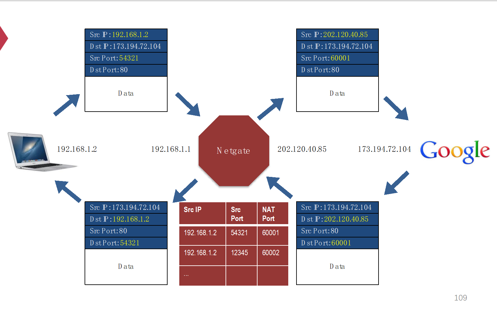
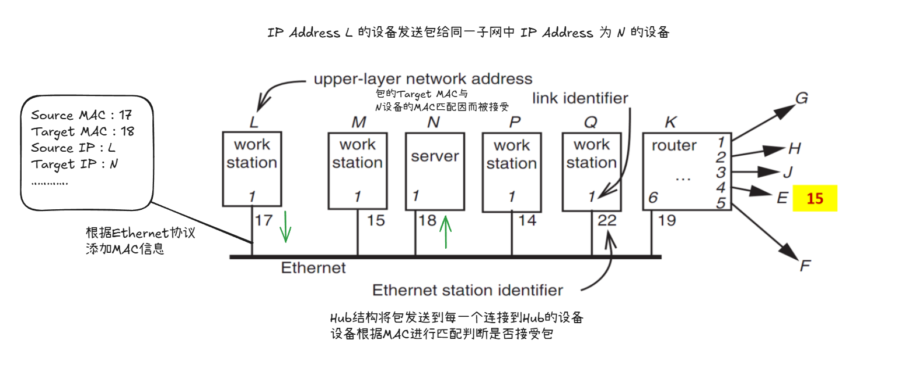
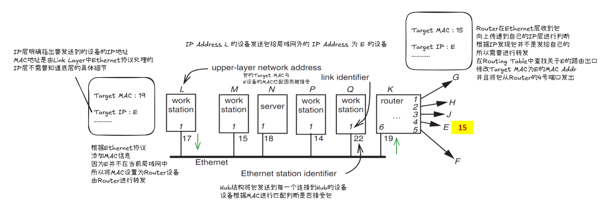
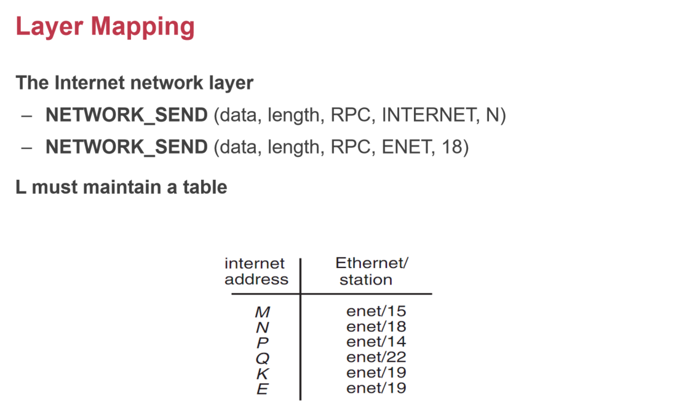
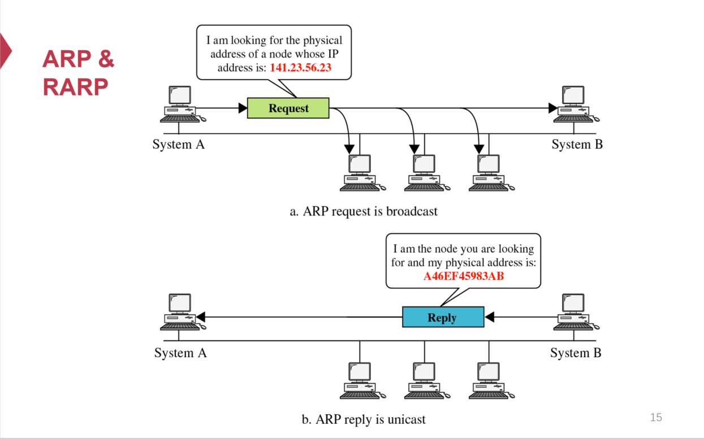
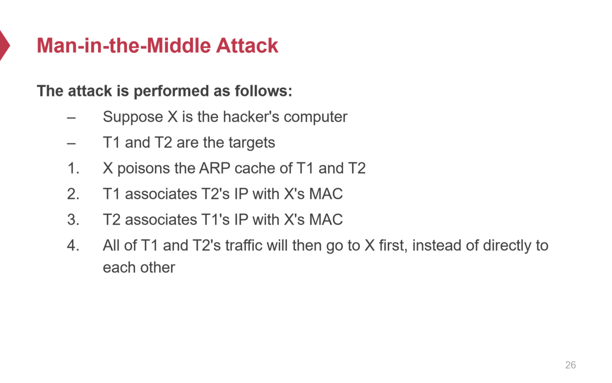

# Network Layer

## Network Layer

* 网络层主要负责数据在不同局域网之间的传输。

* 网络层的接口可以抽象为

  > NETWORK_SEND (segment_buffer, destnation, network_protocol, end_layer_protocol)
  >
  > NETWORK_HANDLE (packet, network_protocol)

  即按照一定的协议，从源按照一定的路径将数据传输到给定的目的主机。

* 网络层用 IP Address 来标识每一个局域网，通过一定的算法来得到将数据从Source经过多个路由器到达Destination的路径，在这条路径上进行数据转发。

## 路由

* 路由器从一个网口接收到数据，会有多个出口，需要决定从哪个出口进行包转发。
* 路由器维护一张Routing Table，以此来决定当收到一个网络包的时候，根据其目标IP地址，来通过对应的出口转发到下一个节点。

## Routing Table

路由表的操作分为两部分

* Control-Plane：如何高效的构建一个Routing Table，需要能够动态的跟踪网络中节点的变化。
* Data-Plane：如何根据已经构造好的Routing Table快速的找到数据包转发的出口。

## Routing Algorithm

### Link-State Routing

* Advertisement

  一个路由节点向其他路由节点发送的信息仅包含**该路由节点直接连接到的路由节点以及到达对应路由节点的代价**，也即**该节点的邻居节点及到邻居节点的代价**。

* Flooding

  一个路由节点通过**泛洪机制**来使得其所在的**网络中每个节点**都获取到该路由节点需要向外传递的**Advertisement信息**(即**该节点的所有邻居节点相关信息**)。路由节点将Advertisement发送至**直接连接的所有节点**，收到Advertisement的节点再将Advertisement**转发**至所有其直接连接的节点，通过像“泛洪”一样的转发最终整个网络中的每个节点都会获取到该路由节点的Advertisement。当然每个节点需要记录是从哪一节点接收到发来的Advertisement，**避免往回发送导致循环**。

  Flooding本身信息传输开销很高，需要在网络中不断地转发包，但是Flooding这种信息传输机制对于有路由节点掉线的情况来说容错性更好。

* Information Change

  一个路由节点向外发送Advertisement当且仅当该节点的Advertisement信息发生变化。

* Dijkastra Algorithm

  当路由节点收集到**该网络中所有的拓扑信息**之后，**执行Dijkastra算法**，生成Routing Table，Routing Table对于网络中的每一个路由节点，记录到达这个路由节点的**转发出口**以及**相应代价**。

  > Dijkastra Algorithm in Link-state Routing
  >
  > 假设以点 s 为起点，计算到达网络中所有节点的最短路径（代价最小路径），过程中维护routing_table & cost_table。
  >
  > * routing_table[i]表示以 s 为源转发消息到达节点 i 需要 s 将消息转发到哪一个邻居节点
  > * cost_table[i]表示以 s 为源转发消息到达节点 i 需要的最小代价
  >
  > 初始情况下
  >
  > * routing_table[s] = s
  > * cost_table[s] = 0
  > * 所有其余节点 u： routing_table[u] = ? & cost_table[u] = ∞
  >
  > 网络中所有节点初始都在集合T中，集合S存储已经找到最短路径的节点。
  >
  > * 从T中选取 cost 最小的节点 u
  >   * T ← T - { u }
  >   * S ← S - { u }
  > * 对于 u 的每一邻居 v
  >   * 若 cost(u,v) + cost_table[u] < cost_table[v]
  >     * cost_table[v] = cost(u,v) + cost_table[u]
  >     * routing_table[v] = routing_table[u] (通过u到达v，到u的路径在s的出口赋值给到v的路径在s的出口)
  > * 重复执行上述操作直到 T 为空

* Failure

  每个节点的信息通过Flooding机制在网络内传播，因此如果有节点下线，其原本的邻居节点会感知到下线并且通过Flooding机制更新其Advertisement到网络中所有其他节点，这样子每个路由节点的Routing Table可以及时更新。

### Distance-vector Routing

* Advertisement

  一个路由节点向其他路由节点发送的信息包含**所有该节点已知的可达节点信息以及相应代价**。

* Neighbor

  一个路由节点并不向所有路由节点发送信息，而是**只向自己的邻居节点发送Advertisement**。

* Relaxation (Bellman-Ford Algorithm)

  当节点接收到**邻居节点的距离向量**时，它会根据邻居的距离信息来**更新自己的路由表**。如果通过邻居节点路由到达某个目标节点的距离比当前已知的距离更短(当前节点到邻居节点的代价 + 邻居节点到目标节点的代价 与 当前节点到目标节点的代价进行比较)，则更新该目标的**最短距离以及路由出口**。如果路由出口是传来Advertisement的邻居节点，但是到达同一目标的代价发生了变化，也要更新路由表。

  一次松弛后得到的Routing Table并非最终的Routing Table，该节点得到整个网络的最优Routing Table必须经过**多轮迭代**，即将**该轮松弛后的Routing Table中所有信息再次发送给邻居节点**。

  Relaxation本质是Bellman-Ford Algorithm。

  > Bellman-Ford算法本质是对每一条边进行松弛，并且在经过|V| - 1轮迭代后必定可以计算出从源点到达图中其他所有点的最短路径。
  >
  > 记*dst(u)*为从源点*s*到达节点*u*的最短路径值，对于图中的每一条边*(u,v)*，如果 *dst(u) + l~u,v~ < dst(v)*，则更新*dst(v)*以及*prev(v)*，经过 |V| - 1次迭代必定会收敛。

  相比于Link-State算法来说，Distance-Vector在每一次收到邻居发来的Advertisement之后就根据该Advertisement中的信息来更新Routing Table中的记录，因此Routing Table到达收敛必须经过多轮迭代。但是如果网络拓扑结构变化速度快于收敛速度，那么整个网络的Routing Table就会一直处于变化当中，无法收敛。

* Infinity Problem

  > 如果某一节点中途掉线，可能导致其他节点到达该节点的路径循环依赖。
  >
  > 
  >
  > 解决infinity，就需要调整发送给邻居节点的Advertisements。假设节点A发送给节点B Advertisement，Advertisement中包含A可达节点以及对应的代价，如果其中某一可达节点通过的出口是A→B，那么就不将该条信息包含在发给B的Advertisement中，即可避免循环依赖。
  >
  > 

## Scale the Routing

### Path Vector

对于原先的Distance-Vector Algorithm，不仅仅只记录路由出口，而是记录到达某一节点的具体路径，即中间经过的每一个节点，并且在向邻居节点传递Advertisement时包含具体的路径。Path Vector可以加快Distance-Vector的收敛时间。


### Hierarchy

* 将临近的路由节点绑定在一起成为一个区域，跨区域的路由方式在路由表中以**区域为粒度**进行路由表的记录，形成层次化的路由表，Hierarchy的方法可以很好地压缩路由表大小。
* 区域中的每一个子节点中的路由表分为两个：**Region Forwarding路由表**（负责跨区域的转发）以及**Local Forwarding路由表**（负责区域内路由节点的转发）。
* 层次化的路由表结构意味着必须将具体的地址与区域相绑定，这样才能够在**给定一个IP地址**的情况下，快速识别出具体**属于哪一个区域**，而后在路由表中根据区域来进行转发。
* 区域内部还可以进一步进行子区域的划分，按照这种方式构建多层次的路由。

### Topological Addressing

* 对于IP地址进行压缩，将连续的IP地址划为一个区域，给定一个IP地址，通过子网掩码可以快速得出其对应的区域。

* 被压缩的IP地址在路   由表中只用一条记 录就可以进行存储（压缩为一个Region），减少了路由表中记录的信息量。

  > e.g.
  >
  > 18.0.0.0 ~ 18.0.0.255 → 18.0.0/24
  >
  > 给定一个IP地址，只看前24位即可识别出属于18.0.0.0 ~ 18.0.0.255区间的地址。原本路由表中需要存储256个条目，变为只需要存储1个聚合条目。

------

## Data Plane


------

## NAT (Network Address Translation)

### 流程

局域网内的设备通过在局域网内唯一的私有IP进行通信，但是如果要访问局域网之外的设备，就需要通过公有IP，而局域网外面的设备无法通过局域网内设备的私有IP来访问到对应设备，所以当局域网内的设备要与公网中的设备进行通信时，需要进行地址转换，即需要一个中间设备来进行私有地址&公有地址之间的转换。



* 局域网内的设备将包发送给NAT Router，NAT Router将Source IP & Source Port修改为这个局域网对外统一的公网Source IP以及在NAT Router上的一个映射端口，将修改后的包发送到公网中的另一端。
* 返回的包会通过修改过后的公网Source IP发送到 NAT Router 对应的端口上。NAT Router维护一个NAT表，NAT表存储局域网中设备私有IP & 对应端口到NAT Router端口的映射。NAT Router通过NAT表查找到NAT Router的某一端口映射的是哪一个局域网中发来的包的设备，将从公网中发来的数据包修改 Destination IP 为对应设备的私有IP以及对应的端口，将包转发给对应的设备。
* 局域网中设备通过私有 IP 与 NAT Router 交互，外部网络利用NAT Router的公网IP与NAT Router交互。每次局域网内设备发送包到NAT Router进行地址翻译转换以将包发送到公网中时，NAT必定要分配一个端口来进行映射，以保证外网设备发送信息回来时知道该发向 NAT 的哪个端口，并且NAT根据端口映射来将包返回给原设备。

### 局限

* 一个NAT Router中的端口是有限的，局域网中设备每一次对外发包，也即一次会话，都必须占用NAT中的一个端口，如果局域网中设备非常多，并且每个设备都占用NAT中的多个端口对外进行连接，端口很可能会用尽，并且NAT表可能会很大，导致查找效率下降。
* NAT技术破坏了网络各层的封装性，因为NAT Router必须要能够修改对应包头中的Src & Dst IP 以及 Port。

------

## Ethernet

### MAC地址

MAC地址是硬件地址，用于标识网络设备的物理接口。MAC地址是在局域网中的唯一标识，但是不能进行跨局域网的通信，跨局域网的通信仍需要IP地址来进行唯一标识，也就是说MAC地址作用在局域网内部各个设备之间的通信。

MAC地址主要在Link Layer中进行使用，而IP地址则是更高一层的Network Layer中进行使用。

### Ethernet

Ethernet是Link Layer层中基于MAC地址的协议，主要用于局域网内设备的通信。

Ethernet层接口可以抽象为`Ethernet_send`和`Ethernet_handle`

```pseudocode
procedure ETHERNET_HANDLE (net_packet, length)
  destination ← net_packet.target_id
  if destination = my_station_id # 收到的包target MAC address 与自己的 MAC 相匹配则需接受包
      or destination = BROADCAST_ID # 如果是一个要求所有设备收到的广播的包则需接受包
    then
    GIVE_TO_END_LAYER (net_packet.data, 
                       net_packet.end_protocol, 
                       net_packet.source_id) # 向上层传递包
  else
    ignore packet	# 无视包
```

Link Layer层通过Ethernet协议进行包传输时，上层Network层传下来的包必定会带有Network层协议所需的包头，里面会包含Source IP & Target IP，这是网络层需要的信息。而Link Layer层通过MAC地址进行包传输，所以会在此基础上添加Ethernet协议需要的包头，包含Source MAC & Target MAC。

### 拓扑结构

* Hub：Hub结构相当于一条线上有多个接口，所有设备可以连接到这条线上，一个设备发出包，Hub就会将这个包发到所有端口上，也就是说所有连接到Hub上的设备都可以收到这个包，由设备自己判断是否接受对应的包。Hub的工作方式本质是广播式通信。
* Switch：Switch结构会记录连接到Switch上的所有设备的MAC地址，这样子能保证根据MAC地址准确发送包。Switch的工作方式是基于MAC地址表的交换式通信。

### 工作流程





### 底层映射

根据IP & Ethernet结合的工作流程可以看出，底层需要一个IP Address 到 MAC Address的映射：如果对应的IP Address设备在当前这个网段内，要设置对应的MAC信息来保证Link Layer层能够进行传输；如果对应的IP Address设备不在当前这个网段内，就需要将包的MAC信息设置成当前网段内可以进行转发的Router设备的MAC地址。

比如上面例子中L的映射表应该是如下的结构。



为了维护这个底层中IP Address -> MAC Address映射，需要协议来使得刚加入局域网中的设备能够逐步构建起这个映射。

### ARP协议(Address Resolution Protocol)

Ethernet通信中，数据包需要使用MAC地址作为目标地址。而Ethernet所在层之上的层通信通常使用IP地址，因此需要一种机制将目标IP地址解析为目标设备的MAC地址，ARP协议就是为此设计的。

新加入局域网中的设备可以通过广播向局域网内其他设备索要某个IP Address到特定MAC Address的映射，获取到后就存储在本地。



### ARP投毒 & 中间人攻击



## All In One Case

